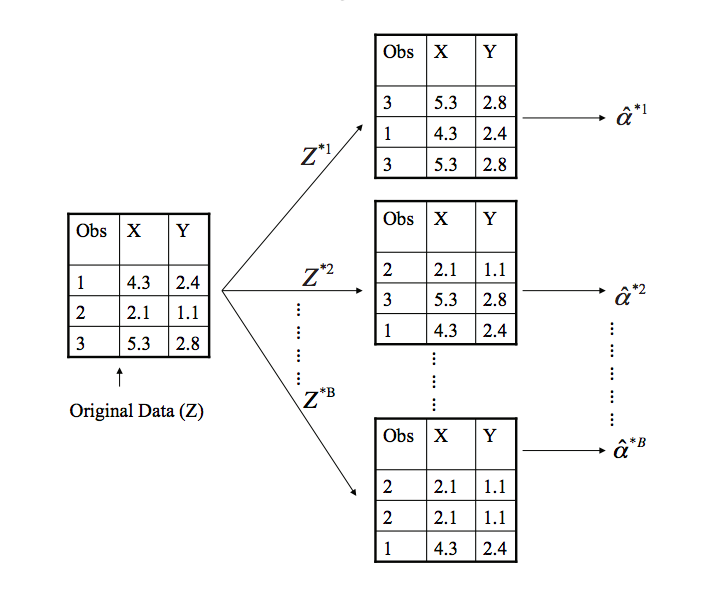

```{r setup, include=FALSE}
library(learnr)
library(tidyverse)
knitr::opts_chunk$set(echo = TRUE)

set.seed(127)
df <- data.frame(Day = 1:30,
                 A = round(rnorm(30, mean = 300, sd = 120), 2),
                 B = c(98.83, rep(NA, 29)))

A <- df$A

```


## Introduction

One of the assumptions of a t-test is that the observations being compared are normally distributed.  This is what makes it a so-called *parametric* statistical test: it uses the *parameters* of the normal distribution (mean and standard deviation) to detect a difference between groups. But what if the observations being compared are not normally distributed? The t-test is actually quite robust to violations of the normality assumption. Still, it may sometimes be prudent to double check t-test results with a *nonparametric* statistical test that makes no assumptions about the data, such as the `wilcox.test()`. 

This tutorial focuses on a general non-parametric approach for estimating standard errors, the bootstrap, and walks you through how to  use the technique to estimate the [standard error](https://en.wikipedia.org/wiki/Standard_error) (SE) not just for the mean but for *any* sample statistic. 

Why does that matter, you ask?   After all, the previous module  covered confidence intervals in some detail, which are explicitly defined  in terms of the SE, and in that case we used a formula to estimate the SE:  $\frac{s}{\sqrt{n}}$. Why not just keep using that? The answer is that we can, and will, but  there are a number of other sample statistics, such as the median, for which there is no theoretically-derived formula to estimate the SE.  Furthermore, the formula for SE assumes the sample is normally distributed.  If it is not then the formula will not do a good job of estimating the standard deviation of the sampling distribution.  To obtain the SE in these situations requires a different approach. 

Why do we care about the SE, anyway?  Because we use it for inference. As we saw in the last module, 95% CIs offer an informal decision procedure by defining the range of mean values most consistent with the sample. Our example was the A/B test, with 29 observations of means for the A ad and---due to a data collection error---just one mean for the B ad. We constructed a 95% CI for the A sample, and then compared the single B observation to this interval.  The interval contained the B observation,  allowing us to conclude that the B observation *could* have come from the A distribution, and that the observed difference was not statistically significant (but that more research was probably warranted).

The value of the bootstrap is that it gives us the ability to simulate a sampling distribution for any statistic from any sample (provided that $n \ge 30$), calculate its standard deviation (which, because it is a sampling distribution, is equivalent to the SE), and define a CI.  Thus, we can use the bootstrap to do inference for *any* sample statistic.  This is extremely useful.

Before explaining and illustrating the bootstrap I'd like to start out by offering a few cautions about p-values.

## P-Values

As we've seen, p-values represent the probability in the null distribution of a value as extreme or more extreme than the observed test statistic occurring. We can think of it as a measure of surprise: the smaller the p-value the more surprised we would be if the observed test statistic occurred by chance. Used cautiously, p-values are a helpful data analytic tool.  But they have problems you should be aware of.

### The sample size problem

Statistical significance---as determined by a small p-value---is strongly influenced  by $n$.  The larger the sample size the easier it is to detect very small differences, which may be practically insignificant. In such situations p-values are largely worthless. Conversely, there may be very large and important differences that are not statistically significant simply because the sample size is small.

This point can be easily illustrated with simulation.  Consider two scenarios: 1. Tiny true difference between two samples but large $n$ results in small p-value.  2. Large true difference between samples but small $n$ results in large p-value ($p>.05$).

```{r ex1, exercise = T}
############################################
### Scenario 1: Tiny difference, Large n ###
############################################

# Draw samples from N(0,1) and N(.005, 1)
set.seed(123)
sims <- 100000
sample1 <- rnorm(n = sims, mean = 0, sd = 1)
sample2 <- rnorm(n = sims, mean = 0.005, sd = 1)

# Calculate t-statistic
t_stat <- (mean(sample1) - mean(sample2))/
  sqrt(var(sample1)/sims + var(sample2)/sims)

# Calculate p-value
pt(t_stat, df = sims - 2) * 2 # significant

```

```{r ex2, exercise = T}
##############################################
### Scenario 2: Large difference, Small n ####
##############################################

# Draw samples from N(0,1) and N(1, 1)
set.seed(123)
sims <- 8
sample1 <- rnorm(n = sims, mean = 0, sd = 1)
sample2 <- rnorm(n = sims, mean = 1, sd = 1)

# Calculate t-statistic
t_stat <- (mean(sample1) - mean(sample2))/
  sqrt(var(sample1)/sims + var(sample2)/sims)

# Calculate p-value
pt(t_stat, df = sims - 2) * 2 # not significant

```

To put this point in real world terms, suppose that an academic program increases student term GPA by .01.  This difference is statistically significant: $p < .05$.  So, the program appears to have a real effect, which is to say that difference is not merely an artifact of chance. *But who cares!*  What we should care about is what we will call "effect size"---the magnitude of the difference---*along with* statistical significance. *P-values do not measure the strength of a relationship, but rather the probability that the observed relationship occurred by chance*. That matters, certainly, but you should not focus on p-values to the exclusion of effect sizes!

### The arbitrary threshold problem

The threshold for significance is arbitrary. Why is $\alpha$ set at .05 and not .1 or .01?  If we set $\alpha$ at .05, then what do we do if *p* =.055? .051? .049?  Indeed, in 2016, the American Statistical Association (ASA) issued a [statement](https://amstat.tandfonline.com/doi/full/10.1080/00031305.2016.1154108#.Vt2XIOaE2MN) cautioning researchers against getting fixated on the magic $p < .05$ number.  In the [press release](https://www.amstat.org/asa/files/pdfs/P-ValueStatement.pdf) accompanying the statement the Director of the ASA commented: 

>The p-value was never intended to be a substitute for scientific reasoning. Well-reasoned statistical arguments contain much more than the value of a single number and whether that number exceeds an arbitrary threshold. The ASA statement is intended to steer research into a "post p<0.05 era."

### The problem of dichotomizing

P-values are usually dichotomized (significant or not significant) but they shouldn't---can't---be compared in this way.  The difference between significant and non-significant p-values is not itself statistically significant!

### Confidence intervals are better

Often CIs can be used in place of (or in addition to) p-values.  95% CIs provide the same information as p-values with $\alpha$ of .05 but also tell us a little more:

- The proximity of a difference or an effect to 0.
- The width of the interval (and thus the uncertainty of point estimate).
- The size of the effect.

CIs tend to offer a better way to evaluate evidence than p-values, encouraging
more flexible and contextual thinking about data. Bottom line: don't use p-values mechanically! Think about your data and weigh the evidence.

## The Bootstrap

Bootstrapping, also known as resampling, was invented by Stanford statistician Bradley Efron in the late 1970s.  It was one of the first computational techniques for statistical estimation. The name comes from the phrase "to pull oneself up by the bootstraps." 

The bootstrap involves "resampling" from a source dataset ($Z$) multiple times to create "bootstrap samples" ($Z^{*1}, Z^{*2}, Z^{*3}...Z^{*B}$), calculating a sample statistic each time ($\hat\alpha^{*1},\hat\alpha^{*2},\hat\alpha^{*3}...\hat\alpha^{*B}$.  Each bootstrap sample contains different observations and therefore produces a slightly different sample statistic.  



The collection of these sample statistics, called the "bootstrap distribution," approximates a sampling distribution for that statistic, the standard deviation of which is the standard error. That is why the technique is called "bootstrapping."  It seems to accomplish the impossible: a sampling distribution is generated without actually going through the expense and trouble of a large scale sampling effort. (Note that the source dataset should have $n \ge 30$ for the bootstrap to provide good estimates.)

Let's illustrate the method using the flight delays example we analyzed from the previous module.  The question we addressed there was whether on‐time performance for RegionEx was worse than for MDA, as measured by `delay`. One of the issues in the case was to select the appropriate metric for comparison.  The mean was problematic because of outliers in RegionEx delays, apparent in the density plot:

```{r include =F}
d <- read_csv("data/flight_delay_clean.csv")


```

```{r x1, exercise = T}
# Plot delay by airline
ggplot(d, aes(delay, col = airline))+
  geom_density() +
  theme_minimal()+
  labs(title = "Arrival delay in minutes by airline")
```

It turned out, curiously, that RegionEx had higher average delays but lower median delays.  

```{r x2, exercise = T}
# Calculate summary statistics
d %>% 
  group_by(airline) %>% 
  summarize(n = n(),
            mean = mean(delay, na.rm = T) %>%  round(2),
            median = median(delay, na.rm = T) %>%  round())
```

In general, the median is the appropriate measure of central tendency when there are outliers.  In this case we can see that the medians are different. But is the difference statistically significant?  This is a question best addressed by bootstrapping, since the formula for computing an SE for the median, in order to do statistical inference, is obscure, requires large $n$ to be accurate, and depends on strong normality assumptions.  One of the advantages of the bootstrap is its generality: a single method can be used to compute SEs for *any* sample statistic.

The null hypothesis, $H_0$, is that MDA and RegionEx delays come from the same population and that the observed difference is due to random sampling variation. Our inferential strategy will be to simulate a sampling distribution of median delay difference using the bootstrap.  Assuming $H_0$, the resulting bootstrap distribution should be centered at 0 and the 95% CI should include 0.  If it does not then we can reject the null hypothesis. 

### Bootstrap steps

1. Initialize an empty vector to store the bootstrap distribution of delay differences. This vector will be a simulated sampling distribution.

```{r x3, exercise = T}
# Initialize empty vector
boot_distribution <- NULL

```

2. Define a `for` loop, in each iteration of which we will calculate and store a simulated difference in median delay. These stored delay differences will be the bootstrap distribution. Because we will be using a random process inside the loop we also need to set the seed, and should also define the number of simulations.  We will also divide the data into RegionEx and MDA subsets before the loop since dividing it once is much faster than dividing it within each loop  `i` times.

```{r x4, exercise = T}
# Initialize empty vector
boot_distribution <- NULL

# Define number of simulations
sims <- 1000

# Subset data
regionex <- filter(d, airline == "RegionEx")
mda <- filter(d, airline == "MDA")

# Set up the for loop
set.seed(123)
for(i in 1:sims){
  
}

```

The number of iterations is somewhat arbitrary.  Generally 1000 iterations should be sufficient.

3. Within the loop, for each iteration, take a bootstrap sample of the original subsetted data and calculate the median, storing it in the initialized vector.  How do we take a bootstrap sample?  Simply use the `sample()` function with `replace = TRUE`. (The dplyr functions, `sample_frac()` and `sample_n()` work well too.) 

```{r x5, exercise = T}
# Initialize empty vector
boot_distribution <- NULL

# Define number of simulations
sims <- 1000

# Subset data
regionex <- filter(d, airline == "RegionEx")
mda <- filter(d, airline == "MDA")

# Calculate the difference in median delays for each iteration
set.seed(123)

for(i in 1:sims){
  
  boot_regionex <- sample(regionex$delay, replace = T)
  boot_mda <- sample(mda$delay, replace = T)
  
  # These are both temporary bootstrap samples that will be overwritten/redefined
  # for every loop.
  
  boot_distribution[i] <- median(boot_regionex) - median(boot_mda)
  
  # We index the vector, boot_distribution, with [i] in order to accumulate
  # a new simulated difference for each loop iteration.
  
}

# Inspect the bootstrap distribution of difference in median delay
head(boot_distribution, 20)

```

```{r, echo = F}

boot_distribution <- NULL

sims <- 1000

regionex <- filter(d, airline == "RegionEx")
mda <- filter(d, airline == "MDA")

set.seed(123)
for(i in 1:sims){
  boot_regionex <- sample(regionex$delay, replace = T)
  boot_mda <- sample(mda$delay, replace = T)
  boot_distribution[i] <- median(boot_regionex) - median(boot_mda)
}

```


```{r x5_5, exercise=T}

# Visualize the bootstrap distribution of medians
  ggplot(data.frame(median = boot_distribution), aes(median)) +
  geom_histogram() +
  theme_minimal()+
  labs(title = "Bootstrap distribution of difference in sample medians")
```

4. Use the `quantile()` function to calculate a 95% CI using the bootstrap distribution.

```{r ex6, exercise = T}

# Define CI by 2.5th and 97.5th percentiles
quantile(boot_distribution, probs = c(.025, .975))

```

This is the so-called "percentile method" for calculating a CI.  Another option, which produces a similar but more robust result, would be to use the standard deviation of the bootstrap distribution---equivalent to the SE---to compute the CI analytically, as follows:


```{r x7, exercise = T}
# Calculate lower and upper bounds for 95% CI
mean(boot_distribution) - 1.96 * sd(boot_distribution)
mean(boot_distribution) + 1.96 * sd(boot_distribution)
```

The results are very similar. 

Why have we used 1.96? As a simulated sampling distribution, the bootstrap distribution will be normally distributed (roughly) due to the Central Limit Theorem. We can therefore exploit the properties of the normal distribution, using the region defined by $\pm$ approximately 2 standard deviations around the mean to define the central 95% of the data.

Back to our question.  The 95% CI for median delay difference does not include 0.  We can therefore confidently reject the null hypothesis and conclude that median delay for MDA is significantly higher than for RegionEx (even as RegionEx's *mean* delay was higher than MDA's).

Do we need a p-value?  Not really. The CI provides that information and more. But computing a p-value is straightforward using the bootstrap distribution.

```{r x8, exercise = T}
# Calculate p-value using bootstrap distribution
sum(boot_distribution >= 0) / sims
```

This tells us that median delay difference of 0---our null hypothesis---would essentially never happen in the bootstrap distribution.

## Bootstrap Details

#### Sampling with replacement

Sampling with replacement  means that before every draw all of the items in the source dataset are replaced and are therefore available for being drawn again.  Here is an example:

```{r x9, exercise = T}

sample(c("A", "B", "C", "D", "E"), replace = T)
sample(c("A", "B", "C", "D", "E"), replace = T)
sample(c("A", "B", "C", "D", "E"), replace = T)
sample(c("A", "B", "C", "D", "E"), replace = T)
```

Notice that because items are returned to the source data before every draw, they can be *over*sampled. Contrast this with sampling without replacement:

```{r x10, exercise = T}

sample(c("A", "B", "C", "D", "E"), replace = F)
sample(c("A", "B", "C", "D", "E"), replace = F)
sample(c("A", "B", "C", "D", "E"), replace = F)
sample(c("A", "B", "C", "D", "E"), replace = F)
```

Here there is no oversampling because sampled items are never replaced.  Each sample therefore repeats the source data exactly, but with the order shuffled.

#### For loops

In general in R programming it is best to avoid loops, as they can be quite slow. However, bootstrapping is one task that is most easily accomplished with a loop (though vectorized methods do exist). 

In a for loop, the index or counter for each iteration is defined in the first line of code: `for(i in 1:n)`.  Here the index is `i` (but we could choose any string, such as `for(reps in 1:n)`). In the first loop `i` will be 1, in the second 2, and so on.  If we want to store information generated in each loop, then we need to initialize an empty vector or data frame beforehand.  In the above code we indexed the initialized vector, `bootstrap_distribution`, with `i`---``bootstrap_distribution[i]`---so that each loop adds a new value to the vector up to `n`. Here is a simple example.

```{r x10_25, exercise = T}

for(i in 1:10){
  print(i)
}

```


#### Setting the seed

Setting the seed once before the loop will suffice to make the results reproducible.  That is because R will automatically change the seed with each new random process (each bootstrap sample in each loop in this case) but will do so deterministically.  So the seed for each loop will not be the value set originally---if it were there would be no variation---but will be deterministically related to the one before.  Consider:

```{r x10_5, exercise = T}
set.seed(123)
sample(c("A", "B", "C", "D", "E"), replace = T)
sample(c("A", "B", "C", "D", "E"), replace = T)

set.seed(123)
sample(c("A", "B", "C", "D", "E"), replace = T)
sample(c("A", "B", "C", "D", "E"), replace = T)

```

The results are identical, and therefore reproducible, even though we have not explicitly set the seed for the second random process.

## Bootstrap Example

We have seen how to use the bootstrap to calculate the SE for a sample median.  In the case of the median, there is no alternative estimation method, so we cannot compare the performance of the bootstrap to an accepted benchmark. In order to convince you that the method works, let's now use the bootstrap to calculate SEs for RegionEx and MDA *mean*  flight delay, and compare the result to the following CIs estimated analytically:

```{r x11, exercise = T}
# Calculate summary statistics
d %>% 
  group_by(airline) %>% 
  summarize(n = n(),
            mean = mean(delay),
            se = sd(delay)/sqrt(n),
            lowerCI = mean - 1.96 * se,
            upperCI = mean + 1.96 * se)
```

Note that the implementation will be a little different because our goal is to replicate the CIs for mean delay for each airline.

Here is the bootstrapped CI for RegionEx mean delay.

```{r ex12, exercise = T}
# Initialize empty vector
boot_distribution <- NULL

# Define number of simulations
sims <- 1000

# Subset data
regionex <- filter(d, airline == "RegionEx")

# Calculate the RegionEx mean for each iteration
set.seed(123)
for(i in 1:sims){
  boot_distribution[i]<- sample(regionex$delay, replace = T) %>%  mean
}

quantile(boot_distribution, probs = c(.025, .975))

```


```{r ex13, exercise = T}
# Initialize empty vector
boot_distribution <- NULL

# Define number of simulations
sims <- 1000

# Subset data
mda <- filter(d, airline == "MDA")

# Calculate the MDA mean for each iteration
set.seed(123)
for(i in 1:sims){
  boot_distribution[i]<- sample(mda$delay, replace = T) %>%  mean
}

quantile(boot_distribution, probs = c(.025, .975))

```


The resulting CIs are very close to those we estimated analytically, using the formulas.

## Other Non-parametric Methods

Other non-parametric tests for comparing samples include the Mann-Whitney test, the Kolmogorov-Smirnoff (KS) test and the Kruskal-Wallis test.  These are very useful tests (since data is usually not normally distributed in the real world), that, unfortunately, are not as powerful---not as sensitive to sample differences--- as parametric tests.  This is generally true of non-parametric methods: they have fewer assumptions but are less powerful than their parametric counterparts.

### Mann-Whitney and KS tests

The Mann-Whitney test is analogous to the t-test.  The null hypothesis, when comparing two samples, is that they both come from the same population.  

```{r ex14, exercise = T}
# The syntax is the same as the t-test
wilcox.test(x = filter(d, airline=="RegionEx")$delay,
            y = filter(d, airline=="MDA")$delay, 
            alternative = "two.sided")
```


The KS test is similar.  

```{r ex14, exercise = T}
# The syntax is the same as the t-test
ks.test(x = filter(d, airline=="RegionEx")$delay,
            y = filter(d, airline=="MDA")$delay, 
            alternative = "two.sided")
```


### Kruskal-Wallis test

The Kruskal-Wallis test is analogous to ANOVA, in that it can compare multiple samples  The null hypothesis, when comparing samples, is that they both come from the same population.  The syntax is a little different from  `t.test()` or `wilcox.test()`.  Group membership is specified with the `g` argument:

```{r ex15, exercise = T}
kruskal.test(x = d$delay,
             g = d$airline)

```

These tests produce nearly identical results, though the test statistics are different.  The significant p-values indicate that the null hypothesis should be rejected:  these delays do not come from the same population.  

## Linear Regression

In the introduction to this tutorial, we noted that the bootstrap is a general method for estimating standard errors for any test statistic. Could it be used with regression? Yes. The bootstrap offers a non-parametric alternative for calculating standard errors and confidence intervals for regression coefficients. 

Here are the steps:

1. Initialize a vector for storing the regression coefficient of interest. 
2. Set the seed for reproducibility.
3. Set up a loop.
4. Within each loop take a bootstrap sample, fit the regression, and extract and store the desired regression coefficient.
5.  Compute the confidence interval and assess statistical significance. Vote

First, let's fit a simple linear regression model of delay using airline as a predictor.

```{r}
lm(delay ~ airline, data = d) %>% 
  summary
```
Notice here that the coefficient for `airline`, which represents the average delay difference between RegionEx and MDA, is not quite statistically significant.  This is surprising, especially considering the results from the other tests. The confidence interval for the coefficient will be: 

```{r}
4.762 - 1.96 * 2.599 # Lower bound
4.762 + 1.96 * 2.599 # Upper bound
```

The confidence interval tells us that, according to this analysis, the slope of the regression line is not statistically distinguishable from  0. However, this estimate may be questionable due to the very large standard deviation of delay in RegionEx caused by outliers.

Let's double check with the bootstrap.

```{r}
n <- 1000

coefs <- NA

set.seed(123)

for(i in 1:n){
  boot_index <- sample(1:nrow(d), nrow(d), replace = T) # random index of rows
  boot_sample <- d[boot_index, ] # create bootstrap sample from the row index
  model <- lm(delay ~ airline, data = boot_sample) # fit model with bootstrap sample
  coefs[i] <- coef(model)[2] # extract model coefficient
}

quantile(coefs, probs = c(.025, .975))
```

