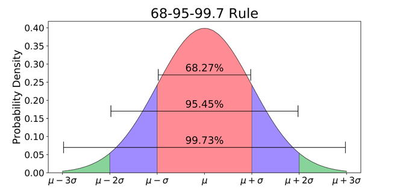

```{r setup, include=FALSE}
library(learnr)
knitr::opts_chunk$set(echo = T, message = F, warning = F)
library(knitr)
library(tidyverse)
library(tidyr)
library(kableExtra)

delay <- read_csv("data/flight_delay_clean.csv")
```


##  Samples and Populations

Data analysis often begins with a question or hypothesis, commonly stated in terms of a relationship between variables  or difference between groups. Is sales related to price?  Do customers who see ad A behave differently than those who see ad B?  If exploratory data analysis  turns up an  apparent relationship or difference we will often want to ask whether the discovery is "statistically significant." Is it just a quirk of a particular sample of data (in which case it would not likely to appear in another sample), or does it exist in the population?

**Population**:  the total set of similar items or events, existing or hypothetical,  needed to answer a question or conduct and evaluate an experiment. The numeric characteristics of a population, such as mean and standard deviation (denoted with the Greek letters $\mu$ and $\sigma$), are called *parameters*.

**Sample**:  a subset of individuals or objects collected or selected from the population by a defined procedure.  The numeric characteristics of the sample are called *statistics*.  The mean and standard deviation of a sample are denoted $\bar x$ and $s$.

Researchers are rarely in a position to take a census to learn about a population.  For that reason, population parameters are usually unknown.  Researchers  typically work with random samples from the population instead and use statistical tools to  make educated guesses---inferences---about population parameters based on sample statistics. (Indeed, it is not an exaggeration to say that statistics is the science of making such inferences.)  *The problem with samples is that they provide varying information about the population  simply because they are samples:  they contain different individuals or observations.* The goal in working with samples, then, is to find out whether  observed  relationships between variables or differences between  groups represent *real* relationships or differences---that is, to find out whether they exist in population---or are likely due to random variability between samples. 

For example, an economic researcher may  be interested in the relationship between salary and smoking in the United States. Do people who smoke make less than (or more than) people who do not smoke? The population for such a study would be everyone earning a salary in the United States.  Obviously, getting information from  the entire American labor force  would be, practically speaking, infeasible. Such a researcher would  instead come up with a way of randomly sampling the population, and then would use the tools of statistics to  make inferences  based on the sample  about the population.  (Note that while "population" connotes a group of people, as here, we will use the term more to refer more abstractly to the total set of items under study.)


```{r ex1, echo = F}
quiz(
  question("A researcher at Target  is studying the the effects of the Great Recession on the purchasing behavior of  Target customers in 2009. The dataset consists in customer transactions  from all Target stores in 2009.  Does the dataset  represent the population for this study or a sample  from the population?",
    answer("The population", correct = TRUE, message ="The study is defined  by a single year and all the transactions for that year can be  exhaustively enumerated in a (very large) dataset. The researcher is therefore working with the  population, as defined by the aim of the study."),
    answer("A sample", message ="The study is defined  by a single year and all the transactions for that year can be  exhaustively enumerated in in a (very large) dataset. The researcher is therefore working with the  population, as defined by the aim of the study")
  )
)

```

```{r ex2, echo = F}
quiz(
  question("A researcher at Target  is studying the the effects of the Great Recession on the purchasing behavior of  Target customers in 2009. The dataset consists in customer transactions  from three representative Target stores in 2009.  Does the dataset  represent the population for this study or a sample  from the population?",
    answer("The population",  message ="While all the transactions for 2009 could be  included in a dataset,  the researcher is working with a subset of these transactions.  The dataset represents a sample from the population."),
    answer("A sample", correct = TRUE, message ="While all the transactions for 2009 could be  included in a dataset,  the researcher is working with a subset of these transactions.  The dataset represents a sample from the population.")
  )
)

```

```{r ex3, echo = F}
quiz(
  question("A researcher at Target  is studying the the effects of economic downturns generally on the purchasing behavior of  Target customers. The dataset consists in petabytes of historical customer transaction data that includes information on every Target purchase ever.  Does the dataset  represent the population for this study or a sample  from the population?",
    answer("The population",  message ="The goal of the study  is not time-bound.  The researcher is interested in the behavior of Target customers generally, not just those who happen already to have been customers.  The dataset,  though very large, is a sample. The researcher will be interested in making inferences  based on the sample of historical customers about the population, which includes future customers and future economic downturns,  and which therefore cannot be completely enumerated."),
    answer("A sample", correct = TRUE, message ="The goal of the study  is not time-bound.  The researcher is interested in the behavior of Target customers generally, not just those who happen already to have been customers.  The dataset,  though very large, is a sample. The researcher will be interested in making inferences  based on the sample of historical customers about the population, which includes future customers and future economic downturns,  and which therefore cannot be completely enumerated.")
  )
)

```


This tutorial reviews foundational statistical concepts and walks through specific procedures and code examples that you will need to  complete the case for this module.  The case involves analyzing an A/B test, a type of experiment run commonly by ecommerce companies to evaluate which version of a website---A or B---is more effective.  "More effective" generally means something like:  produces more clicks or  more spending.  The key question in the analysis is whether the difference between the A and B groups in the experiment is real---in which case it is a population difference---or is merely the result of sampling variability.  Answering this question accurately is obviously essential for executive decision-making.  


##  Statistical Inference Example

Suppose that you work as an analyst at a marketing firm and you've been asked to to determine which of two ads on a website, A or B, seems to generate more clicks from customers. You decide to run an A/B test in which you randomly select visitors to the website to see one of the two ads, A or B. (Random selection is important: it ensures there will be no systematic difference between the two groups, other than ad exposure, and that the samples of customers are representative of the population of customers.) The data generated from the experiment consists in  total daily clicks. You run the experiment for 30 days. The data you get back from IT thus consists in 30 rows.   The top six rows looks like this:

```{r, echo = F}
set.seed(127)
d <- data.frame(Day = 1:30,
                 A = round(rnorm(30, mean = 300, sd = 120), 2),
                 B = abs(round(rnorm(30, mean = 250, sd = 170), 2)))

d[1:6,] %>% 
  kable %>% 
  kable_styling()

A <- d$A

```

Take a closer look at the click data:

```{r summary, exercise = T}
d %>% 
  select(-Day) %>% 
  summary
```


Hmmmm.  The mean is slightly higher for the A group, compared to B, as is the median. But B has a much higher maximum.

Plot the observations.

```{r plot, exercise = T}
d %>% 
  pivot_longer(-Day, names_to = "Group", values_to = "Clicks") %>% 
  ggplot(aes(Clicks, col = Group)) +
  geom_density() +
  labs(title = "Results from the A/B test") +
  theme_minimal()  
```


The difference in means indicates that the A ad is better at generating clicks than the B ad in this sample. But is the difference "statistically significant"?  Is this, in other words, a population difference as well as a sample difference?  

We answer such questions using the null hypothesis statistical testing or NHST.

## Basic Statistical Concepts

It can be hard to wrap your head around NHST at first, so let's go through it point by point.

Let's start out by reviewing four related ideas:

1. Sampling distribution.
2. Standard error.
3. The Central Limit Theorem.
4. Properties of the normal distribution.

### Sampling distribution

The concept of a sampling distribution is crucial for statistical inference.   What is a sampling distribution? If you were to repeatedly take random samples from a population and calculate for each sample a statistic, such as the mean, the resulting distribution of sample means would constitute a sampling distribution.  (Note a key distinction:   A sample  distribution consists in the individual *observations* that make up the sample, whereas the sampling distribution consists in *statistics* calculated from many samples from population.)  I write "if you were to..." because in practice we do not create a sampling distribution; it is a theoretical distribution. Instead, we *estimate* its properties, such as the mean and standard deviation, based on information from a single sample. 

Do the samples used to create a sampling distribution need to be random samples? Yes. All observations in the population must have an equal probability of winding up in the sample---this is what "random" means---in order to ensure that the samples are truly representative of the population. If some observations are more likely to be included then sample will be biased, preventing reliable inferences about the population.

Key fact: the mean of a sampling distribution will converge to the population mean at large $n$.  When we estimate the properties of the sampling distribution, then, our goal is really to make inferences about the population. The chain of inferential reasoning goes:  sample --> sampling distribution --> population.

```{r ex4, echo = F}
quiz(
  question("Jenny has been asked to compile a report on monthly expenditures at her company.  She has a dataset consisting in daily expenses over 10 years, with a row for each expense.  Is the distribution of daily expenditures a sampling distribution?",
    answer("Yes",  message ="A sampling distribution results from repeatedly taking a random sample from a population and calculating a sample statistic like the sample mean. In this case there is no sampling procedure and no sample statistics."),
    answer("No", correct = TRUE, message ="A sampling distribution results from repeatedly taking a random sample from a population and calculating a sample statistic like the sample mean. In this case there is no sampling procedure and no sample statistics.")
  )
)

```


```{r ex5, echo = F}
quiz(
  question("Jenny has been asked to compile a report on monthly expenditures at her company.  One of the statistics her boss wants to see is a monthly average of daily expenditures.  Jenny calculates average daily expenditures for each calendar month using 10 years of company data.  Is this distribution of 12 monthly averages a sampling distribution?",
    answer("Yes",  message ="A sampling distribution is  based on repeated random sampling from a population. These monthly averages are not from random samples but are instead merely a summary of what has occurred historically in each calendar month."),
    answer("No", correct = TRUE, message ="A sampling distribution is  based on repeated random sampling from a population. These monthly averages are not from random samples but are instead merely a summary of what has occurred historically in each calendar month.")
  )
)

```


### Sampling distribution video (optional)


### Standard Error

The standard deviation of a sampling distribution is called the [standard error](https://en.wikipedia.org/wiki/Standard_error) or SE. As a standard deviation, the SE represents the average deviation of individual sample statistics from the mean of the sampling distribution. We know that with continued sampling the mean of the sampling distribution will eventually converge to the population mean for a given statistic. The SE therefore gives us some sense of *estimation uncertainty* associated with using the statistic from a single sample to make inferences about a population parameter.   It tells us the likely difference between the sample statistic as an estimate of the population parameter and the actual population parameter, the amount off. It is a give or take number: the estimate give or take the SE.

How do we derive the SE?  As noted, the sampling distribution is theoretical.  We do not take multiple samples from a population in actual analytic situations---too expensive, too time-consuming, and often not even possible with unlimited time and money---and so, as a workaround, we use information from a *single* sample to *estimate* the SE.  For the sample mean the formula is $SEM = \frac{s}{\sqrt{n}}$, where $s$ is the sample standard deviation and $n$ is the number of observations in the sample. (The standard error of the mean is an important case that we designate as $SEM$.) Several points are worth emphasizing about this formula:

1. *As n grows large, SEM gets smaller*.  More data *increases* our certainty that the sample mean, $\bar{x}$, is close to the population mean, $\mu$.

2. *As sample variability increases, SEM gets larger.*  Sample variability *decreases* our certainty about the relationship between $\bar{x}$ and $\mu$.

```{r ex6, echo = F}
quiz(
  question("A researcher has calculated the SE for a sample mean by dividing the sample standard deviation by the square root of the number of observations.  The resulting standard error is 2. This quantity tells us what?",
    answer("The estimated standard deviation of the sampling distribution.",  message ="SE is the standard deviation of the sampling distribution for a sample statistic, in this case the sample mean.  Under repeated sampling the SE represents the average difference of each sample mean from the overall mean of the sampling distribution, which at large n will converge to the population mean.  The larger the SE the less likely any given sample mean will be close to the population mean.  The SE is thus a measure of certainty: it quantifies how confident we should be that a sample mean is a good estimate of the population mean."),
    answer("The estimated average difference under repeated sampling between a sample mean and the population mean.",  message ="SE is the standard deviation of the sampling distribution for a sample statistic, in this case the sample mean.  Under repeated sampling the SE represents the average difference of each sample mean from the overall mean of the sampling distribution, which at large n will converge to the population mean.  The larger the SE the less likely any given sample mean will be close to the population mean.  The SE is thus a measure of certainty: it quantifies how confident we should be that a sample mean is a good estimate of the population mean."),
    answer("How close the sample mean probably is to the population mean. For example,  a sample mean with an SE of 2 is likely to be closer to the population mean than a sample mean with a larger standard error.",  message ="SE is the standard deviation of the sampling distribution for a sample statistic, in this case the sample mean.  Under repeated sampling the SE represents the average difference of each sample mean from the overall mean of the sampling distribution, which at large n will converge to the population mean.  The larger the SE the less likely any given sample mean will be close to the population mean.  The SE is thus a measure of certainty: it quantifies how confident we should be that a sample mean is a good estimate of the population mean."),
    answer("All of the above", correct = TRUE, message ="SE is the standard deviation of the sampling distribution for a sample statistic, in this case the sample mean.  Under repeated sampling the SE represents the average difference of each sample mean from the overall mean of the sampling distribution, which at large n will converge to the population mean.  The larger the SE the less likely any given sample mean will be close to the population mean.  The SE is thus a measure of certainty: it quantifies how confident we should be that a sample mean is a good estimate of the population mean.")
  )
)

```

### Standard error of the mean video (optional)


### Central Limit Theorem (CLT)

The CLT guarantees that a sampling distribution will be normally distributed even when the samples themselves, from which the statistics were originally computed, are not normally distributed. This is an amazing fact.  Let's take a closer look at how it works using simulation.

Consider 20 random samples from $U(0,1)$, a uniform distribution in which every possible observation has the same probability of being chosen over the specified range.

```{r echo=F, message=F}
set.seed(123)
df <- data.frame(observation = runif(100000),
                 sample = factor(1:20) )

ggplot(df, aes(observation)) +
  geom_histogram()+
  facet_wrap(~sort(sample))+
  theme_minimal()+
  labs(title= "Samples from U(0,1)")
```


Here each panel represents a different sample from $U(0,1)$, and you can see that, despite variations, the probability of an observation being sampled is the same over the range [0, 1]. The differences are due exclusively to random sampling variation.  With larger $n$, in fact, all the bars would be the same height. 

Now, an amazing transformation occurs when we compute the mean for each sample  and plot the resulting **sampling distribution** of those means.  The sampling distribution with 20 means begins to look normally distributed.

```{r echo=F, message=F}

df %>% 
  group_by(sample) %>% 
  summarize(means = mean(observation)) %>% 
  ggplot(aes(means)) +
  geom_histogram()+
  theme_minimal()+
  labs(title= "Sampling distribution of sample means from U(0,1) for n = 20")
```


With 500 means it is clearly normal in shape.

```{r echo=F, message=F}
set.seed(123)
df <- data.frame(observation = runif(1000000),
                 sample = factor(1:500) )


df %>% 
  group_by(sample) %>% 
  summarize(means = mean(observation)) %>% 
  ggplot(aes(means)) +
  geom_histogram()+
  theme_minimal()+
  labs(title= "Sampling distribution of sample means from U(0,1) for n = 500")
```

The normality of the sampling distribution is what allows us to do statistical inference. Why? **The normal distribution has known properties that allow us to do exact probability calculations.**

<!-- Of course, we usually can't sample repeatedly from a population---this turns out to be too expensive or cumbersome in actual experimental situations. More typically, we have one sample with known mean and standard deviation. We would use these sample statistics to estimate the properties of the unobserved sampling distribution which, being normally distributed according to the CLT, we could then use to do exact probability calculations. -->

### Central limit theorem video (optional)


### Properties of the Normal Distribution

In the normal distribution 68% of the observations are within approximately $\pm$ 1 standard deviations of the mean, 95% are within approximately $\pm$ 2 standard deviations, and 99.7% are within 3 standard deviations. This is the information conveyed in this familiar plot:



This plot depicts a normal density curve. What is the cumulative distribution of probability densit in the red portion of the curve in the range [$\mu - \sigma$, $\mu + \sigma$]? The picture says 68.27. For $N(0,1)$, the corresponding range would be $[0-1, 0+1]$. As we saw in the last module, we can calculate this density directly using the `pnorm()` function:

```{r x7, exercise = T}
# Calculate probability density for [-1, 1]
(pnorm(q = 1, mean = 0, sd = 1) - 
   pnorm(q = -1, mean = 0, sd = 1)) * 100
```

<!-- ###  Back to the A/B test -->

<!-- Is the analysis salvageable? Well, -->

<!-- - Each observation is a sample statistic:  a daily average of  hourly clicks. Hence the distribution of average daily clicks for the A ad is a sampling distribution. -->
<!-- - Because of the CLT, the distribution for A will be normal.  (It may not look quite normal but that is only because $n = 30$. We assume that if the experiment continued the curve would converge to normality.) -->

<!-- Is the B observation consistent with the properties of the A distribution? We can answer this using NHST reasoning and `pnorm()`.  The basic strategy  is to compare the single B mean to the distribution of A means to see how rare it would be. How often would observations as extreme or more extreme than B happen for the A ad given that the mean of A was 294.89 with standard deviation of 103.31?  -->

<!-- ```{r x2, exercise = T} -->
<!-- # Calculate p-value -->
<!-- pnorm(q = 98.83, mean = 294.89, sd = 103.31) -->
<!-- ``` -->

<!-- Not very often.  The probability of that observation would be fairly low. But is it low enough to qualify as a "statistically significant" difference?  Let's review NHST. -->

### Summary of basic concepts

Let's summarize what we know.

1. The mean of a sampling distribution converges to the population mean, $\mu$, while the standard deviation, or SE, gauges the likely difference between any single sample mean and the population mean.  
2. The sampling distribution is a normal distribution.
3. A normal distribution has known properties. For example, 95% of the data lies within approximately $\pm$  2 standard deviations of the mean.
4. Based on these known properties, the estimated mean and standard deviation of the sampling distribution can be used to calculate the probability density for regions of the distribution.

Basically all of statistical inference---the procedures for assessing statistical significance--- follows from these ideas.

## NHST

In the A/B test we observed a mean difference between the two groups.  Is it a "statistically significant" difference? Let's review the logic of null hypothesis statistical testing or NHST.

In frequentist statistics we use NHST to make inferences about  differences between samples or, as we'll see later on in the context of regression, relationships between variables. Basically, the approach is *proof by contradiction*: assume no difference/relationship, then attempt to disprove the assumption. Here are the components of NHST.

- **Null hypothesis** ($H_0$): *What we start out assuming in order to try to disprove*. In the case of the A/B test, A has a higher mean, but we will start by assuming that the difference in means is due to random sampling variation and that there is no population difference. (The alternative hypothesis, designated $H_a$ or $H_1$, is that there *is* a population difference in means.)
- **Null distribution**:  *The sampling distribution we would expect if the null hypothesis were true*. In general, when comparing means, the null distribution will be a sampling distribution of sample mean differences centered at 0.  Why 0?  Because the null hypothesis is:  no difference. As a sampling distribution we expect it to be normal, due to the central limit theorem. Most commonly we compare means using a t-test, in which sample mean differences are expressed as standardized values with t-statistics.  More on that topic below.
- **P-value**: The probability of finding values equal to or more extreme than the observed statistic (for the A/B test this is a difference in means) in the null distribution. 
- **$\alpha$**: The arbitrary probability threshold, by convention $p <.05$, used to decide whether the the observed difference is compatible with the null hypothesis. Usually we use a so-called "two-tailed test" which apportions half of $\alpha$ (2.5%) in the left tail of the null distribution and half in the right tail, for a total of 5%.  
- **Statistical significance**.  If an observation falls in those tail regions of the null distribution, in the percentile range $[-\infty, \alpha /2]$ or $[1 - \alpha /2, \infty]$, then we would reject the null hypothesis.  For this reason we call those regions "rejection regions." A picture helps to visualize this.  The rejection regions in the tails are shaded in red.

```{r, echo = F}
probs <- data.frame(t = seq(-4, 4, by=.1))
probs$density <- dt(probs$t, df = nrow(probs))
plt <- ggplot(probs, aes(t, density)) +
    geom_line()+
  geom_area(aes(ifelse(t< -1.96 , t, NA), density), fill = 2, alpha = .5, na.rm=T)+
  geom_area(aes(ifelse(t > 1.96 , t, NA), density), fill = 2, alpha = .5, na.rm=T)+
  theme_minimal() +
  labs(title="Null distribution for A/B test with rejection regions")
suppressWarnings(print(plt))

```

- **Type I error**:  Wrongly rejecting the null hypothesis.  The above plot of the null distribution illustrates that NHST will, with an $\alpha$ of .05, lead us to incorrectly interpret an extreme observation as inconsistent with the null distribution about 5% of the time. *Misinterpreting random variation between samples as a population difference is always a hazard in the NHST approach.* It should be clear that decreasing $\alpha$ will have the effect of decreasing the risk of Type I errors.
- **Type II error**: Not rejecting the null hypothesis when it should be rejected. In this case a real difference or relationship is missed because it is hard to discern, often due to low $n$.

To summarize: 

1. The null distribution is the sampling distribution of sample mean differences that we would expect to see if the null hypothesis were true---if the samples were drawn from the same population. It is hypothetical:  what would be the case if....
2. The null distribution, as a sampling distribution, is, due to the CLT, a normal distribution with known probability density.
3. The procedure for calculating the p-value for an observed difference in means is to compare it to the null distribution. How rare would that difference be under the null?
4. If the probability of the observed difference is small---less than $\alpha$, which would put the difference in the rejection regions of the null distribution---then we have evidence that the null hypothesis, what we started out assuming, is incorrect. 
5. We would then "reject the null." However, remember that rejecting the null is not the same thing as proving the alternative hypothesis correct!

```{r ex8, echo = F}
quiz(
  question("The null distribution is a distribution of sample statistics.",
    answer("True.", correct = TRUE,  message ="The null distribution is a sampling distribution, hence a hypothetical distribution of sample statistics as opposed to actual individual observations.  In the case of the A/B test the statistic of interest is the difference between sample means that has been standardized as a t-statistic.  We start out by assuming that the null hypothesis is true, namely that both A and B observations are drawn from the same population, and that any difference between them is due purely to random sampling variation. The null distribution is the distribution of difference statistics that would occur by chance."),
    answer("False.",  message ="The null distribution is a sampling distribution, hence a hypothetical distribution of sample statistics as opposed to actual individual observations.  In the case of the A/B test the statistic of interest is the difference between sample means that has been standardized as a t-statistic.  We start out by assuming that the null hypothesis is true, namely that both A and B observations are drawn from the same population, and that any difference between them is due purely to random sampling variation. The null distribution is the distribution of difference statistics that would occur by chance.")
  )
)

```

```{r ex9, echo = F}
quiz(
  question("Is the null distribution for a comparison of means calculated from the data?",
           answer("No",  correct = TRUE, message ="The null distribution does not consist in observed differences.  Rather, it is hypothetical distribution of the sample mean differences that we would expect to see if the null hypothesis were true.  The key word here is 'if.'"),
    answer("Yes",  message ="The null distribution does not consist in observed differences.  Rather, it is hypothetical distribution of the sample mean differences that we would expect to see if the null hypothesis were true.  The key word here is 'if.'")
  )
)

```

```{r ex10, echo = F}
quiz(
  question("The null distribution for a comparison of means will always be centered at 0.",
           answer("False.",  message ="The null hypothesis for a comparison of means is:  no difference. Therefore the null distribution is centered at 0."),
    answer("True.", correct = TRUE,  message ="The null hypothesis for a comparison of means is:  no difference. Therefore, the null distribution is centered at 0.")
  )
)

```


### Videos on NHST (optional)


<!-- For the A/B test, we started out by assuming no difference between A and B is not different from A and the p-value we calculated for B under the null was small.  Have we then proved that B *is* different from A? -->

### NHST on the A/B test

There are two possible approaches:

- *Formal decision procedure*. Use a t-test to exactly compute the p-value of getting the observed difference between A and B under the null hypothesis. A t-test uses the t-distribution rather than the normal distribution for inference, which tends to work better (is more conservative) in low $n$ situations. If the p-value for the test is less than $\alpha$ (usually set at .05) then the null hypothesis would be rejected and the difference would be judged statistically significant.

- *Informal decision procedure*. Estimate a 95% confidence interval (CI) for the difference in means between A and B.  If the interval includes 0 then we can say that the observed difference is consistent with the null distribution, and we would not reject the null hypothesis.  If the interval does not include 0 then we would reject the null hypothesis.  Failure to reject the null does not prove the alternative hypothesis, of course, but it at least provides reasonably strong evidence for it.

Inference with a 95% CI is essentially equivalent to inference with a t-test with $\alpha$ = .05. The CI identifies the 95% of values most *consistent* with the observed difference in means, while p-values from a t-test, based on $\alpha$ of .05, identify the 5% of values that are *inconsistent* with the null distribution. The two approaches, p-values and CIs, just carve up the probability density in opposite ways. 

###  T-test

The null distribution for a t-test is defined by the t-distribution, which is basically identical to the normal distribution except that it has fatter tails at small $n$. (At large $n$ the distributions are identical.) The t-distribution consists of the t-statistics that would occur if there were no population difference between the samples being compared.  The distribution is therefore centered at 0, with non-zero values due to random sampling variation.  

What is a t-statistic exactly?  It is a standardized difference in means.  The point of standardization is to make differences in means comparable across contexts by putting them on the same scale.  Here is the formula for a two-sample t-statistic:

$$t \quad = \quad {\; \overline{x}_1 - \overline{x}_2 \; \over \sqrt{ \; {s_1^2 \over n_1} \; + \; {s_2^2 \over n_2} \quad }}.$$

<!-- $$t = \frac{\bar{x_1}-\bar{x_2}}{\frac{s^2}{\sqrt{n}}} $$ -->

The numerator in this formula is simply the difference in means. The denominator is the standard error for a difference in means.  Dividing by the SE ensures that most t-statistics in the null distribution for a t-test will be arrayed around 0 within about $\pm$ 3.  Why?  Go back and look at the normal density curve above and the 68-95-99 rule.  95% of the data in a normal distribution is between approximately $\pm$ 2 standard deviations and 99% is between approximately $\pm$ 3 standard deviations. 

To get an idea of how standardization with t-statistics works, consider the following simulated results of sample mean differences. Some of these raw differences between the groups look quite large.  But the t-statistic calculation  standardizes the differences by accounting for sample variability and n. The n of each sample is 100. The t-statistic is simply the difference in means divided by the SE of the difference.

```{r echo =F}
demo <- data.frame(Difference = 1:10,
                   SE = 1:10)
 
sds <- runif(10, 1, 50) %>% round(1)

set.seed(124)
for(i in 1:10){
  demo$SE[i] = sds[i]
  demo$Difference[i] = (rnorm(1, mean = 0, sd = sds[i]) - rnorm(1, mean = 0, sd = sds[i])) %>% 
    round(1)
}

demo <- demo %>% 
  mutate(`T-statistic` = (Difference / SE) %>% round(1))
library(knitr)
kable(demo)

```

The take-away?  The t-statistic allows us to put observed sample mean differences on equal footing in order to compare them to the null distribution.

That is the NHST game: compare the observed t-statistic to a hypothetical null distribution of t-statistics.  These are the t-statistics we would expect to see if there was no population difference between the samples.  The objective is to see how rare the observed t-statistic would be under the null.  If rare---hence with a small p-value---then we would "reject the null."  

The t-distribution is centered at 0 and has one parameter, degrees of freedom, which will usually be close to $n$.  The calculation of degrees of freedom for the above definition of the t-statistic  is complicated (see [Welch's approximation](https://en.wikipedia.org/wiki/Welch%27s_t-test)); for simplicity estimate degrees of freedom with a conservative shortcut, using the smaller of $n_1 - 1$ and $n_2 -1$. 

Don't worry too much about making theoretical sense of degrees of freedom.  Just know that it basically is equivalent to $n$ and is the parameter for the t-distribution that controls its similarity to the normal distribution:  as degrees of freedom goes up the t-distribution becomes the normal distribution. This happens at about $n=30$.

```{r echo = F}
tcomp <- data.frame(x = rep(seq(-3,3, length.out=1000), 2))
tcomp$Distribution <- c(rep("N(0,1)", 1000),
                        rep("T(10)",1000))
tcomp$density <- c(dnorm(tcomp$x[1:1000], 0, 1),
                  dt(tcomp$x[1001:2000], 10))

ggplot(tcomp, aes(x, density, col= Distribution))+
  geom_line()+
  theme_minimal()+
  labs(title="Comparison of T(df = 10) and N(0,1)")
```

The advantage of using a t-distribution instead of a normal distribution at small $n$ is that it has more probability density in the tails, and, as a consequence, the rejection regions are further out. There is less risk of making a Type I error.  In such cases the t-test is a more conservative approach than the analogous test using the normal distribution, the z-test. For that reason, the t-test is the default method for comparing means.


Here are details for calculating the standard error for a difference in means.  The [variance sum law](https://en.wikipedia.org/wiki/Variance#Sum_of_uncorrelated_variables_(Bienaymé_formula)) tells us that the standard deviation of a sum or difference of random variables, X and Y, is equal to the square root of the sum of the variances: $\sigma _{X \pm Y} = \sqrt{\sigma^2 _{X} + \sigma^2 _Y}$. Remember that the standard error is the standard deviation of a sampling distribution. So to get the standard error for a difference in means we just replace $\sigma^2 _{X}$ and $\sigma^2 _Y$ in the formula with the standard errors calculated from the data, $s_1^2 \over n_1$ and $s_2^2 \over n_2$.

For the A/B test, $\bar{x_1}$ would be the observed mean for A, $\bar{x_2}$ the observed mean for B, $s_1^2$ and $s_2^2$ the variances of A and B, respectively, while $n_1$ and $n_2$ represent the number of observations in each group. We are using a two-sample t-test because we are comparing two samples, represented by two vectors of observations.  If we wanted to compare a single sample to a fixed value then we would use a one-sample t-test.

<!-- The above formula is used to conduct a *one-sample* t-test of means.  In a one-sample t-test a single sample, with measured standard deviation, *s*, is compared to a known mean.  For the purpose of calculating a t-statistic, it doesn't really matter which quantity in the numerator of the formula, $\bar{x}$ or $\mu$, represents the sample mean or the known mean.  All that matters is that the numerator measures the difference between the two, and that the resulting sign makes contextual sense.  Here I would like the t-statistic to be negative, since the mean of B is lower than the mean of A, so I will subtract B from A.  Below we discuss a *two-sample* t-test that compares the means of two samples. -->

<!-- For the A/B test, the standard deviation of A is already a standard error, as explained above, so we don't need to divide $s$ by $\sqrt{n}$.  -->

Here is the calculation of $t$:

```{r x11, exercise = T}
# Extract values

d %>% 
  pivot_longer(-Day, names_to = "Group", values_to = "Clicks") %>% 
  group_by(Group) %>% 
  summarize(mean = mean(Clicks) %>%  round(2),
            variance = var(Clicks) %>%  round(2),
            sd = sd(Clicks) %>%  round(2),
            n = n()) %>% 
  data.frame

# Calculate t-statistic
(t <- (294.89 - 284.34) / sqrt(10672.8 / 30 + 31610.58 / 30))
```

The $t$-statistic is then used to calculate a p-value with a t-distribution as the null.  To get a p-value, we must evaluate the t-statistic using the appropriate degrees of freedom.  Using the conservative shortcut outlined above, degrees of freedom will be the smaller of $n_1 -1$ and $n_2 -1$, which, because the samples are the same size, will be 30 - 1 = 29.  The `pt()` function, which is analogous to `pnorm()`, will calculate the probability density of t-statistics more extreme than the one observed for $T(29)$. In this case our t-statistic is positive, since it lies in the right (upper) tail.  We want to calculate the probability of getting t-statistics that are *equal to or more extreme than the one we have observed*. We therefore need to be careful to calculate the probability not from $[-\infty, .28]$ but rather from $[.28, \infty]$.

```{r x12, exercise = T}
# Calculate 1-sided p-value
pt(q = .281, df = 30 - 1, lower.tail = F) 

```

The p-value is .39.  However, this is the p-value for a single-tailed test. To get a two-tailed test, meaning that the probability is calculated symmetrically for $[-\infty, .28]$ *and* from $[.28, \infty]$, we would multiply the resulting p-value by 2.  this yields a value of .78. Either p-value---for a one-tail or two-tail test---is well above the .05 p-value threshold for significance. Here is a plot of the situation, with the rejection regions in the tails shaded in red.

```{r echo = F}
tval <- .281
probs <- data.frame(t = seq(-4, 4, by=.01))
probs$density <- dt(probs$t, 58)

regions <- qt(c(.025, .975), 58)

plt <- ggplot(probs, aes(t, density)) +
    geom_line()+
  geom_vline(xintercept = tval, col= 2, lty = 2)+
  geom_area(aes(ifelse(t< regions[1] , t, NA), density), fill = 2, alpha = .5, na.rm=T)+
  geom_area(aes(ifelse(t> regions[2], t, NA), density), fill = 2, alpha = .5, na.rm=T) + annotate("text", label ="<--- Observed t-statistic ", x =1.6, y = .075)+
  annotate("text", label ="<-----------------  Rejection regions  --->", x =0, y = .03) +
  theme_minimal() +
  labs(title="Null distribution for A/B test")
suppressWarnings(print(plt))

```

Why do we use a two-tailed test here? 

1. It is more conservative.  As a consequence, it will be less likely to result in a type I error in which we mistake a difference due to random variation for a population difference. Essentially, in a two-tailed test we split $\alpha$ of .05 in two, apportioning 2.5% in the left tail and 2.5% in the right.  This makes the rejection regions smaller---there is less probability density in each tail---and makes it less likely for an observation to wind up in a rejection region. 

2. We don't have any reason for believing prior to the experiment that the B ad is better or worse than the A ad.  It could be either. The choice of a two-tailed test reflects this uncertainty.  A one-tailed test would make sense in a situation in which you knew in advance that the relationship could only go in one direction.

Here is a good discussion of the [differences between one- and two-tailed t-tests](https://stats.idre.ucla.edu/other/mult-pkg/faq/general/faq-what-are-the-differences-between-one-tailed-and-two-tailed-tests/). In general I think two-tailed tests are preferable.

### Using the t.test() function

It is a good idea to double check your work using the built-in `t.test()` function.

```{r x13, exercise = T}
# Two-sample, two-tailed t-test

t.test(x = d$A, # first sample
       y = d$B,  # second sample
       alternative = "two.sided") # argument for two tailed test

```

The results match our hand calculation almost exactly: t-statistic of .28 and p-value of .78.  The degrees of freedom do not match because `t.test()` uses Welch's approximation rather than the shortcut.

The output is somewhat confusing. Remember:  the null hypothesis for the test is that the true (population) difference in means is 0.  A significant p-value means we reject the null. Here the p-value is non-significant (p > .05) so we fail to reject the null.   

Don't get a *two-sample* test confused with a *two-tailed* test.

- A *two-sample* t-test compares the means from two samples represented by vectors of observations. A one-sample test compares a sample against a fixed value.  For example, suppose you wanted to verify gas mileage for a make of car.  After measuring mileage for a variety of different vehicles of the same make (the sample) you could compare this against the manufacturer's point estimate (the fixed value). 

- A *two-tailed* t-test defines rejection regions of $\frac{\alpha}{2}$ in both the lower and upper tails of the null distribution, whereas a one-tailed test puts all of $\alpha$ in one tail.

###  95% confidence interval (CI)

A 95% CI for a sample mean proposes a range of plausible values for the observed statistic. More technically, the confidence level---95% is a common choice---indicates that under repeated sampling  95% of the estimated intervals would contain $\mu$, the population mean.

To calculate a 95% CI for a mean based on a single sample we would use this formula: $\bar{x} \pm \text{critical value} * \big(\frac{s}{\sqrt{n}}\big)$. 

What is the critical value? Remember that $\frac{s}{\sqrt{n}}$ is the standard deviation of the sampling distribution for the sample mean or $SE$.  We know that the sampling distribution is normal (due to the central limit theorem).  The probability density of that distribution can therefore be described precisely in terms of $SE$, with 95% of the observations lying within approximately $\pm$ 2 standard deviations of the mean.  Hence, the critical value for a 95% CI is approximately 2.  What is the number exactly? We can calculate it with the `qnorm()` function.  This function will find the standard deviations (also commonly referred to as z-scores) associated with a particular quantile of the standard normal distribution.  Since we want to apportion half of $\alpha$ in the lower tail and half in the upper (for a conservative, 2-tailed test), the quantiles for $\alpha = .05$ would be [.025, .975].


```{r qnorm, exercise = T}
# Calculate critical value for 95% z-confidence interval
qnorm(c(.025, .975)) %>% 
  round(2)
```

So the actual formula for a 95% z-confidence interval, based on the normal distribution, would be: $\bar{x} \pm 1.96 \big(\frac{s}{\sqrt{n}}\big)$. 

Here is an additional wrinkle. Suppose that what we want is a CI not for a single mean but for a *difference in means*. As noted, a 95% CI for a single mean indicates the range of plausible mean values for additional samples from the same population.  It tells us how much variation in means to expect in multiple samples due to chance alone. A CI for a *difference in means* would, likewise, indicate how much chance variability to expect in the difference between means for samples drawn from the same population. 

Here is the calculation for the A/B test:

<!-- However, $\frac{s}{\sqrt{n}}$ is an estimate of the standard error, which, as we've seen, is the standard deviation of a sampling distribution. A is already a sampling distribution, so in this instance we do not need to divide $s$ by $\sqrt{n}$. We will just use $s$. -->

```{r x14, exercise = T}
# Calculate 95% z-confidence interval for the difference in means
d %>% 
  summarize(n = n(),
            difference = mean(A) - mean(B), # Calculate the mean difference.
            se = sqrt(var(A)/n + var(B)/n), # Calculate SE
            lower_bound = difference - 1.96 * se,
            upper_bound = difference + 1.96 * se)
```

Notice that we use the same formula for the shared standard error as in the t-test. In this case, because the sample sizes are the same, we use the same $n$.  If the sample sizes were different then we'd need to be careful to use the appropriate $n$ for each group in the calculation. 

How would we use this information?  If the two samples are from the same population, then we would expect the difference between them to be 0.  That is the null hypothesis for the comparison, as in a t-test: no difference. Our reasoning would go like this:

- If the 95% CI for the difference in means includes 0 then we would not reject the null hypothesis.  
- If the CI does not include 0 then we would reject the null and conclude that the difference between the samples is likely a population difference (or, to put this another way, we would conclude that the samples are drawn from different populations).

The above calculation suggests that 0 *is* included among the 95% most plausible values for the observed difference in means between A and B. We therefore *would not* reject the null in this case. The observed difference in average daily clicks could have happened by chance---due to random sampling variation.

### 95% t-interval

The above calculation is for a so-called z-interval based on the normal distribution. But for the same reason that we prefer a t-test over a z-test--- it is more conservative---it is  better to create a 95% CI based on the t-distribution. This is particularly true for low $n$ cases, as here. 

The calculation is straightforward. We simply  identify the critical values for the t-distribution at the specified degrees of freedom using the quantile function for the t-distribution, `qt()`, which is analogous to the `qnorm()` function.  The degrees of freedom parameter, for each group, will be $n - 1 = 30 -1 =29$. 

```{r qt, exercise = T}
# Calculate critical value for 95% t-interval 
qt(c(.025, .975), df = 29) %>% 
  round(2)
```

As expected, this will produce a wider interval than the z-interval above.  Being wider, it will be more conservative, having a greater chance of including 0. Remember:  we do not reject the null hypothesis of no difference if the interval includes 0.  However, the greater conservatism of the t-interval is entirely dependent on the size of the sample. Observe  what happens to the critical values for a t-interval   at larger  sample sizes:

DF = 50:
```{r qt_ex1, exercise = T}
qt(c(.025, .975), df = 50) %>% round(2)
```


DF = 100:
```{r qt_ex2, exercise = T}
qt(c(.025, .975), df = 100) %>% round(2)
```

DF = 500:
```{r qt_ex3, exercise = T}
qt(c(.025, .975), df = 500) %>% round(2)
```

With degrees of freedom = 500, a t-interval has converged to a z-interval.

Here is the calculation for the 95% t-intervals:

```{r x15, exercise = T}
# Calculate 95% t-interval for the difference in means
d %>% 
  summarize(n = n(),
            difference = mean(A) - mean(B),
            se = sqrt(var(A) / n + var(B) / n),
            lower_bound = difference - 2.05 * se,
            upper_bound = difference + 2.05 * se)
```

The t-interval is slightly wider than the z-interval that we calculated above.

### A/B test conclusion

We started by assuming that there was no difference between A and B and discovered that the data does not allow us to reject that assumption. The probability of observing a difference of 10.5 in daily average clicks is fairly large.  Even if the A and B ads had no true effect on customer behavior, in other words, we would expect to see differences of this magnitude regularly due to random sampling variation. Hence we can conclude that the ads appear to be equally effective at generating clicks.

<!-- clicks as low as 98.83 is small in the null distribution but not impossible. In fact, our analysis suggests that it would happen more than 5% of the time using a two-tailed test.   We may not "reject the null," then, but that is not the same as proving the null hypothesis true.  Given the data collection problems it would probably be a good idea to extend the experiment. For now, however, we don't have conclusive evidence that differences in the impacts of the A and B ads are larger than would be expected due to random sampling variation. -->

<!-- What if we *had* chosen to use a one-tailed test?  In that case we would have assigned all of our available 5% probability to the left tail rather than splitting it between the two tails, and would have concluded that the difference between A and B was statistically significant!  This illustrates the uncomfortable fact that a statistical result can change based on the researcher's analytic choices.  As noted above, it makes sense to do a two-tailed test in this situation However,there is no right answer; this is a decision requiring careful judgment. -->

How would you communicate this finding? Something like this:  "An experiment comparing ad A to ad B found no statistically significant difference in click generation between the ads."

## Flight Delay Example

You analyzed flight delays in the case for a recent module. The question in that case boiled down to whether on‐time performance for RegionEx was worse than for MDA.  We addressed the question through EDA.  Let's consider it now using the NHST framework.

```{r include =F}
delay <- read_csv("data/flight_delay_clean.csv")

# glimpse(delay)

```

We will work with the delay variable, which has the following distribution for MDA vs. RegionEx:

```{r x16, exercise = T}
# Plot delay by airline
ggplot(delay, aes(delay, col = airline))+
  geom_density() +
  theme_minimal()+
  labs(title = "Arrival delay in minutes by airline")
```

Calculate summary statistics for the two samples.  We should not round the calculated values for mean or standard deviation since we will be using them in further calculations.  (Rounding inputs leads to rounding error!)

```{r x17, exercise = T}
# Calculate summary statistics
delay %>% 
  group_by(airline) %>% 
  summarize(n = n(),
            mean = mean(delay),
            sd = sd(delay),
            median = median(delay), 
            SE = sd / sqrt(n)) %>% 
  data.frame

```

Next, calculate 95% t-intervals for the means in order to do informal inference. We first need to find the critical t-values, which will be different for each airline, which will be $n -1$:


```{r x18, exercise = T}
# Find critical values for df = 120 -1 (MDA)

qt(c(.025, .975), df = 119)

# Find critical values for df = 240 -1 (RegionEx)

qt(c(.025, .975), df = 239)
```

Now we can calculate the t-intervals, which is easy to do manually:

```{r x18_5, exercise = T}
# MDA
 10.9 - 1.98 * .579
 10.9 + 1.98 * .579
            
#RegionEx
15.7 - 1.97 * 1.78 
15.7 + 1.97 * 1.78 
```


In this case the 95% t-intervals do not overlap.  Non-overlapping confidence intervals imply a statistically significant difference.  We can conclude that average delay for RegionEx is statistically larger than for MDA.  (There is, of course, more to the story, as we discovered through analyzing the case.)  

Let's go ahead and complete the analysis using formal decision procedures for illustration.

**Step 1. Define the null hypothesis.**

While there is a mean difference in flight delay between MDA and RegionEx, we will assume it is due to random variation and that there is no population difference. Stated in equivalent terms: we are assuming---and will try to disprove---that the average difference between MDA and RegionEx delays is 0.

**Step 2.  Define the null distribution.**

The null distribution will be the sampling distribution of t-statistics that we would expect if there was no difference in delays between the two airlines. What is the degrees of freedom for the null distribution? In this case the sample standard deviations are very different.  Therefore we will use the conservative shortcut and estimate degrees of freedom as the smaller of $n_1 -1 = 119$ and $n_2 - 1 = 239$.  A t-distribution, reflecting the null hypothesis of no difference, is always centered at 0.

**Step 3. Calculate the t-statistic for a two-sample test.** 

The formula is: 
$$
t = \frac{\bar{x_1}-\bar{x_2}}{\sqrt{\frac{s_1{^2}}{n_1}+\frac{s_2{^2}}{{n_2}}}}
$$

A two-sample t-test is needed because we are comparing, as above, two samples. We can use the summary table above to calculate a t-statistic.  To avoid excessive rounding error we will include 4 decimals for each input using the above table.

```{r x20, exercise = T}
# Define function to calculate t for a 2 sample test
find_t <- function(x1, x2, s1, s2, n1, n2){
  var1 <- s1^2
  var2 <- s2^2
  (x1 - x2)/ sqrt(var1/n1 + var2/n2)
}

# Use function
find_t(x1 = 10.9, 
       x2 = 15.6625, 
       s1 = 6.3384, 
       s2 = 27.6504, 
       n1 = 120, 
       n2 = 240)

```

**Step 4. Calculate the p-value for the observed t-statistic.** 

Compare this value of $t$ to a null distribution defined by $T(119)$ (as explained above).   To get the associated p-value use `pt()`.  Remember to multiply the p-value by 2 for a two-tailed test.

```{r x21, exercise = T}
# Calculate p-value for two-tailed test
pt(q = -2.5383, df = 120 -1) * 2

```

**Step 5: Interpret the test.**

We can reject the null hypothesis that there is no difference in arrival delays between RegionEx and MDA. According to the above analysis, the difference is statistically significant and would be very unlikely to happen by chance.  RegionEx flight delays are larger than MDA's.

Here is a plot of the null distribution including critical values and the observed $t$-statistic. Note that `dt()` returns the density of the $t$-distribution with defined degrees of freedom for different input values. Also, `qt()` is analogous to `qnorm()`, used here to identify the critical values that define the rejection regions at the 2.5th and 97.5th percentiles. 

```{r x22, exercise = T}
# Define critical values
critical_values <- qt(c(.025, .975), df = 120 - 1)

# Define and plot the null distribution with rejection regions
data.frame(t = seq(from = -5, to = 5, by = .01)) %>% 
  mutate(density = dt(t, df = 120 -1)) %>% 
  ggplot(aes(t, density))+
  geom_line()+
  geom_ribbon(aes(x = ifelse(t < critical_values[1], t, NA), 
                  ymin = 0, 
                  ymax = density),
              fill = "red") +
  geom_ribbon(aes(x = ifelse(t > critical_values[2], t, NA), 
                  ymin = 0, 
                  ymax = density),
              fill = "red") +
  geom_vline(xintercept = -2.5883, lty = 2) +
  theme_minimal() +
  labs(title = "Null distribution for T(119)",
       subtitle = "Rejection regions in red, with observed t-statistic in black")

```

Finally, we can double-check our work using the built in `t.test()` function. The results should be close.

```{r x23, exercise = T}
# Use built in t.test() function
t.test(filter(delay, airline=="MDA")$delay,
       filter(delay, airline=="RegionEx")$delay,
       alternative = "two.sided")
```

And they are.  The low p-value means that the true difference in means is likely not 0 and we should reject the null. 

The results from `t.test()` differ slightly from our calculations above because:

- `t.test()` uses the more complicated (and more accurate) formula to calculate degrees of freedom when the sample variances are different. We used the shortcut consisting in the smaller of $n_1 -1$ and $n_2 - 1$.

- We rounded our inputs to the `pt()` function above. (We rounded to 4 decimals, whereas machine precision in R includes 16 decimals.)

In using a t-test we are assuming that the distributions being compared are normally distributed and well-described with the t-distribution.  If that is not the case---and to decide this requires some judgment---then t-test results  will be inaccurate and a *non-parametric* test, such as the [wilcoxon rank sum test](https://en.wikipedia.org/wiki/Wilcoxon_signed-rank_test) (also known as the Mann-Whitney test),  would be a better choice.  A t-test is relatively robust to non-normality. A generally bell-shaped distribution is fine; no real-world distribution is perfectly normal.  

Still, it is not a bad idea to check our results using the non-parametric  `wilcox.test()`:

```{r echo = T}
wilcox.test(filter(delay, airline=="MDA")$delay,
       filter(delay, airline=="RegionEx")$delay,
       alternative = "two.sided")

```
These results agree almost exactly with the t-test. The low p-value means that the null hypothesis of no difference between the two samples can be rejected. 


**Step 6: Think critically about the result.**

A statistically significant result does not prove anything. It should be used as part of of a broader analysis that includes careful EDA.  In fact, as we saw in the EDA of the Flight Delay case there are many nuances to the case, and we should not allow the appeal of an apparently conclusive result from a t-test comparing means (or even a non-parametric test) to override those nuances. NHST is a tool and should be used to aid---not replace---contextual data analytic thinking. In this case it might make sense to argue that when all the evidence is considered the fact that RegionEx's delays are longer is misleading, that when interpreted correctly, on a per route basis, they are in fact *shorter*!  No test will, by itself, get you to this conclusion.  You must instead think critically about your results, both exploratory and inferential, in the context of the business problem.
