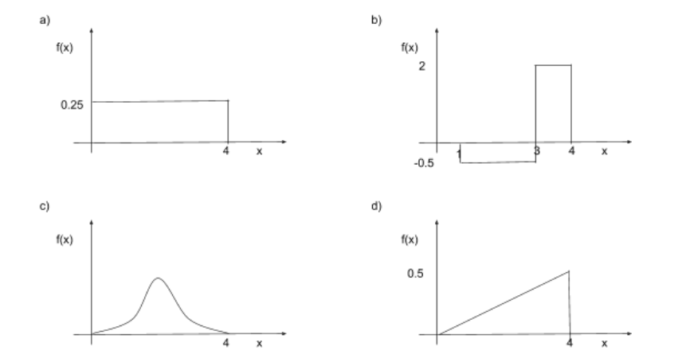
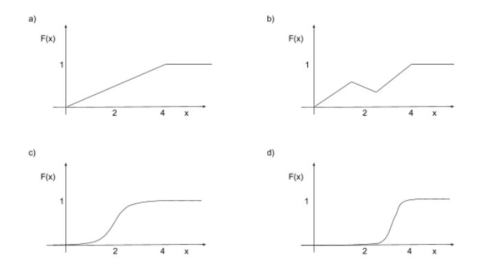
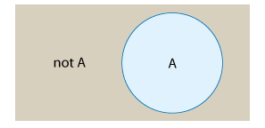
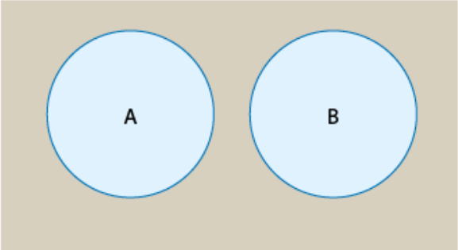
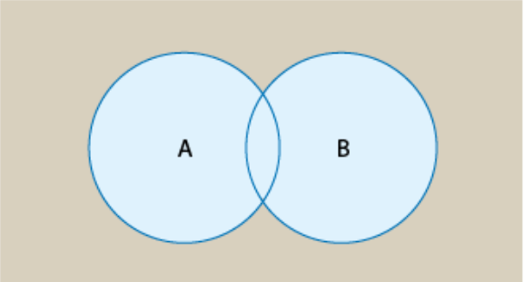
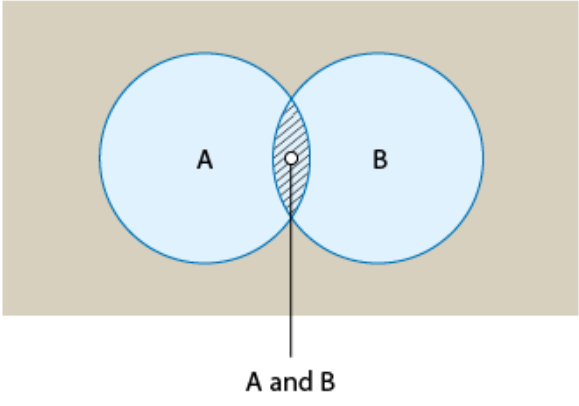
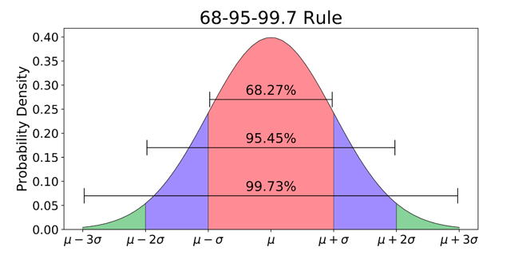

```{r setup, include=FALSE}
library(learnr)
library(tidyverse)
knitr::opts_chunk$set(echo = T)
sims <- 100000

n <- 1000
sim_frame <- data.frame(months = 1:n,
                     fixed_costs = 3995,
                     meals_sold = NA,
                     price_per_meal = NA,
                     profit_per_meal = NA,
                     labor_costs = NA,
                     profit = NA)
set.seed(123)
sim <- sim_frame %>% 
  mutate(meals_sold = rnorm(n = n, mean = 3000, sd = 1000),
         price_per_meal = sample(x = c(20, 18.50, 16.50, 15),
                                 size = n,
                                 replace = T,
                                 prob = c(.25, .35, .3, .1)),
         profit_per_meal = price_per_meal - 11,
         labor_costs = runif(n = n, min = 5000, max = 7000),
         profit = meals_sold * profit_per_meal - labor_costs - fixed_costs)
  

```


## Introduction

The purpose of this tutorial is to give you the knowledge, skills and example code  needed to complete the case for this module. The focus will be on basic ideas in probability, probability distributions and simulation modeling. A simulation model is a computer representation of a problem that involves random variables and their associated probability distributions. 

<!-- The tutorial concludes with an example of simulation modeling. -->

<!-- Probability is generally discussed theoretically, with  definitions and rules. The examples used to teach the subject likewise tend to be theoretical and abstract, relying on coins, cards, dice, balls and urns. (Urns? When was the last time outside of a class on probability that you encountered an urn?)  -->

<!-- The examples in this tutorial will be practical, illustrating how probability and simulation can be used to model events and solve business problems.  The tutorial concludes with an example of simulation modeling.  -->

Why is probability important? Quite simply, it supplies the basis of all statistical analysis.  Understanding what is going on in a regression model, particularly a logistic regression model, is not possible without a solid understanding of probability. Moreover, probability and related concepts such as random variables and probability distributions are foundational to simulation modeling, which has important business applications. For example, a simulation model can forecast the consequences of various management decisions before such decisions must be made. Simulation models are used in a wide variety of management settings:

- Modeling of manufacturing operations.
- Modeling of service operations where queues form (such as in banking, passenger air travel, food services, etc.).
- Modeling of investment alternatives.
- Analysis and pricing of sophisticated financial instruments. 

Simulation modeling helps managers make difficult decisions under uncertainty. 

## Probability

An **experiment** is a procedure that results in one out of a number of possible outcomes. An **outcome** is the result of an experiment. Example: Rolling a six-sided die is an experiment, and the number of dots displayed is an outcome. The set of all possible outcomes is called the **sample space** of the experiment. Example: The sample space of a six-sided die roll is: 1, 2, 3, 4, 5, and 6.

```{r ex1, echo = F}
quiz(
  question("Joe rolls a 6-sided die and records the number of dots displayed. The roll of the die is:",
    answer("an experiment", correct = TRUE, message ="Rolling the die is a procedure that results in one of many possible outcomes. Such a procedure is called an experiment."),
    answer("an outcome", message ="Rolling the die is a procedure that results in one of many possible outcomes. Such a procedure is called an experiment.")
  )
)

```


```{r ex2, echo = F}
quiz(
  question("Joe rolls a 6-sided die and records the number of dots facing up. 4 dots are facing up. The 4 dots facing up are:",
    answer("an experiment", message ="An outcome is the result of an experiment, in this case the number of dots displayed."),
    answer("an outcome", correct = TRUE, message ="An outcome is the result of an experiment, in this case the number of dots displayed.")
  )
)

```


```{r ex3, echo = F}
quiz(
  question("Sally conducts the experiment of rolling a die, repeating the experiment three times, resulting in the three outcomes 2, 4, and 5. The 2, 4, and 5 represent the sample space.",
    answer("True", message ="The sample space is all possible outcomes. For one die roll, the sample space is {1, 2, 3, 4, 5, 6}. Sally's three rolls resulted in three specific outcomes, which are not a sample space."),
    answer("False", correct = TRUE, message ="The sample space is all possible outcomes. For one die roll, the sample space is {1, 2, 3, 4, 5, 6}. Sally's three rolls resulted in three specific outcomes, which are not a sample space.")
  )
)

```


```{r ex4, echo = F}
quiz(
  question("Sally rolls a 6-sided die. The sample space is {1, 2, 3, 4, 5, 6}.",
    answer("True", correct = TRUE, message ="The sample space is all possible outcomes. When Sally rolls the die, the number of dots displayed must be either 1, 2, 3, 4, 5, or 6."),
    answer("False", message ="The sample space is all possible outcomes. When Sally rolls the die, the number of dots displayed must be either 1, 2, 3, 4, 5, or 6.")
  )
)

```


```{r ex5, echo = F}
quiz(
  question("A researcher defines an experiment to be flipping two coins. Frank flips two coins and observes a Heads on the first coin and a Tails on the second coin, represented as HT. HT is an outcome of this experiment.",
    answer("True", correct = TRUE, message ="Frank flipping two coins was defined as an experiment. An outcome is the result of an experiment. In this case, the outcome is what Frank observed on both coins, HT."),
    answer("False", message ="Frank flipping two coins was defined as an experiment. An outcome is the result of an experiment. In this case, the outcome is what Frank observed on both coins, HT.")
  )
)

```

```{r ex6, echo = F}
quiz(
  question("A researcher defines an experiment to be flipping two coins. Frank flips two coins and observes the outcome HT. The sample space is {H,T}.",
    answer("True", message = "The sample space is all possible outcomes of an experiment. Since the experiment involves two coins, the possible outcomes are {HH, HT, TH, TT}."),
    answer("False", correct = TRUE, message ="The sample space is all possible outcomes of an experiment. Since the experiment involves two coins, the possible outcomes are {HH, HT, TH, TT}.")
  )
)

```

For our purposes, the outcomes of an experiment must be specified in such a way that they are mutually exclusive and collectively exhaustive. **Mutually exclusive** means that no two outcomes can occur together. In the case of flipping a coin, the coin cannot be both heads and tails. **Collectively exhaustive** means that at least one of the outcomes must occur when the experiment is performed. A flipped coin must come up either heads or tails. 

The **probability** of an outcome is the likelihood that the outcome will occur when the experiment is conducted. In the case of flipping a coin the probability of heads is .5. The physical interpretation of this is that if we flip a coin a very large number of times, say 1,000,000 times, then the number of heads will be extremely close to 500,000. On average, heads will occur 50% of the time. Put another way, the number .5 is the fraction of times the outcome of the experiment is heads. In this way, we interpret probability of an outcome as its *relative frequency.*  Note that, as relative frequency, probability is always a number between 0 and 1: we count the number of times a particular outcome  occurs and then divide by the number of experiments. In this sense, probability is essentially just a proportion.

A subset of the sample space is called an **event**. For  example,  let's define the event A as  obtaining an even number  when rolling a six sided die. A occurs when a 2, 4, or 6 is rolled. A **compound event** is a subset of the sample space consisting of more than one outcome. Example: A is a compound event since rolling an even number consists of three  possible outcomes. A **simple event** is a subset  of the sample space with a single outcome.  Let's define the event C as rolling a 5 on the die. C is a simple event with a single outcome.


<!-- ```{r ev1, echo = F} -->
<!-- quiz( -->
<!--   question("The event B is rolling less than a 3 on a six-sided die. B is best described as:", -->
<!--     answer("a compound event", correct = TRUE, message ="A compound event is a subset of the sample space with more than one outcome. The sample space for a die roll is {1, 2, 3, 4, 5, 6}. Event B includes the subset {1, 2}, which includes more than one outcome: outcome 1, and outcome 2. -->
<!-- "), -->
<!--     answer("a simple event", message ="A simple event is a subset of the sample space with a single outcome. The sample space for a die roll is {1, 2, 3, 4, 5, 6}. Event B includes the subset {1, 2}, which is more than a single outcome, so B can't be a simple event."), -->
<!--     answer("not an event", message ="An event is a subset of the sample space. The sample space for a die roll is {1, 2, 3, 4, 5, 6}. Event B includes the subset {1, 2}, so B is indeed an event.") -->
<!--   ) -->
<!-- ) -->

<!-- ``` -->


<!-- ```{r ev2, echo = F} -->
<!-- quiz( -->
<!--   question("James conducts an experiment by flipping a coin twice. The sample space for this experiment is {HH, HT, TH, TT}. Which of the following is a simple event?", -->
<!--     answer("James flips two heads", correct = TRUE, message ="A simple event consists of one outcome. In this example, the only outcome that includes flipping two heads is {HH}."), -->
<!--     answer("James flips a heads and tails in any order", message ="A simple event consists of one outcome. The event of flipping a heads and a tails in any order includes the two outcomes {HT} and {TH}, which is more than a single outcome, so is not a simple event."), -->
<!--     answer("Since James is flipping the coin twice, no simple events can exist", message ="The experiment was defined as flipping a coin twice, and thus two flips form a single outcome. Any event that includes only one outcome in the sample space is a simple event, so simple events do exist for this experiment, as for any experiment.") -->
<!--   ) -->
<!-- ) -->

<!-- ``` -->


<!-- ```{r ev3, echo = F} -->
<!-- quiz( -->
<!--   question("A gym teacher defines an experiment to be running a mile race three times in gym class. Sue runs the mile three times. Sue's fastest time was 6:10. This time can best be described as:", -->
<!--     answer("a compound event", message ="A compound event is a subset of the sample space with more than one outcome. Here an outcome consists of all three times. Ex: Sue's outcome might be 6:10, 6:25 and 7:05; a compound event would be more than one set of three times."), -->
<!--     answer("a simple event", message ="Because the experiment involves running the race three times, a single time like 6:10 is not an outcome, because an outcome for this experiment must have three times like 6:10, 6:25 and 7:05. Because a simple event is a single outcome, and 6:10 is not an outcome, then 6:10 cannot be a simple event."), -->
<!--     answer("not an event", correct = TRUE, message ="An event is a subset of the sample space. Here an outcome consists of all three times. Ex: Sue's outcome might be 6:10, 6:25 and 7:05; the fastest time is only one of the three times of an outcome, and is thus not an outcome, so can't be an event.") -->
<!--   ) -->
<!-- ) -->

<!-- ``` -->

### Video on probability (optional)


## Random variables

A **random variable** is a rule that assigns a number to every outcome in the sample space of an experiment. For example,  in the experiment of a coin toss, a random variable may assign 1 to heads and 0 to tails. A random variable is typically defined using a capital letter, such as X = 1 (if the coin toss yielded heads) or 0 (if the coin toss yielded tails).

Random variables can be used to model quantities that can change if an experiment is repeated.


```{r rv1, echo = F}
quiz(
  question("A radar gun records a car's speed. A sign displays the text SPEEDING or NOT SPEEDING. The text displayed is a random variable.",
    answer("True", message ="SPEEDING or NOT SPEEDING are outcomes of the experiment but are not numbers."),
    answer("False", correct = TRUE,message ="SPEEDING or NOT SPEEDING are outcomes of the experiment but are not numbers.")
  )
)

```


```{r rv2, echo = F}
quiz(
  question("A survey asks a participant to indicate eye color. Possible responses are blue, brown, or green. Y is assigned 1 for Blue, 2 for brown, and 3 for green. Y is a random variable.",
    answer("True", correct = TRUE,message ="A random variable assigns a number to every outcome of an experiment. Y assigns a number to each eye color."),
    answer("False", message ="A random variable assigns a number to every outcome of an experiment. Y assigns a number to each eye color.")
  )
)

```


```{r rv3, echo = F}
quiz(
  question("A survey asks a participant to indicate age. Y is assigned the value of the response, which ranges from 1 to 120. Y is a random variable.",
    answer("True",correct = TRUE, message ="A random variable assigns a number to every outcome of an experiment. Y assigns a number to each eye color. Sometimes the assignment is trivial, when the outcomes are already numbers."),
    answer("False", message ="A random variable assigns a number to every outcome of an experiment. Y assigns a number to each eye color. Sometimes the assignment is trivial, when the outcomes are already numbers.")
  )
)

```

```{r rv4, echo = F}
quiz(
  question("A person observes cars that drive past. Y is assigned the car's manufacturer, which may be Ford, Chevy, Toyota, or Honda. Y is a random variable.",
    answer("True", message ="Although Y is assigned a value, that value is not a number. A random variable must assign a number."),
    answer("False", correct = TRUE, message ="Although Y is assigned a value, that value is not a number. A random variable must assign a number.")
  )
)

```


```{r rv5, echo = F}
quiz(
  question("Some airports, like John Wayne Airport in California, measure noise levels when a plane flies over houses near the airport and fines airlines that exceed thresholds. Y is assigned 1 if a plane's measured sound exceeds 100 dB, and 0 otherwise. Y is a random variable.",
    answer("True", correct = TRUE, message ="Sometimes the assignment translates outcome numbers into other numbers. In this case, any sound value above 100 dB is translated to 1, and any sound value 100 dB or less is translated to 0."),
    answer("False", message ="Sometimes the assignment translates outcome numbers into other numbers. In this case, any sound value above 100 dB is translated to 1, and any sound value 100 dB or less is translated to 0.")
  )
)

```


```{r rv6, echo = F}
quiz(
  question("A person wins $100 per dot on the roll of a die. Z is the amount won on a die roll. Z is a random variable.",
    answer("True", correct = TRUE, message ="Z is a random variable since the amount won is a number, in this case one of the outcomes {$100, $200, $300, $400, $500, $600}."),
    answer("False", message ="Z is a random variable since the amount won is a number, in this case one of the outcomes {$100, $200, $300, $400, $500, $600}.")
  )
)

```

A random variable may be discrete or continuous. A **discrete random variable** can take on a countable number of distinct values like the integers between 0 and 100, while a **continuous random variable** can take on any value within a range of values like the real numbers between 0 and 100. 

### Videos on random variables (optional)


## Discrete Random Variables

This section focuses on discrete random variables.  Here are some examples: 

- The possible outcomes of a die roll is one of the distinct values 1, 2, 3, 4, 5, or 6.
- The possible outcomes of the number of tries for a basketball player to successfully make a free throw is one of the distinct values 1, 2, 3, 4, ....
- The weight classification of a randomly selected person from the U.S. population, given that the random variable, W, represents weight classification. W = 0 if the person is underweight, 1 if normal weight, 2 if overweight, and 3 if obese.

A **probability mass function**  captures useful information about a discrete random variable. A probability mass function (PMF) assigns the probability that a discrete random variable is exactly equal to some value (typically represented in a table or plot or equation). The notation p(X=x) or p(x) is typically used for the PMF of X. Example: In recent years, 2% of the adult population of the U.S. is classified as underweight, 27% as normal weight, 33% as overweight, and 38% as obese. The PMF of W is then p(W=0) = 0.02, p(W=1) = 0.27, p(W=2) = 0.33 and p(W=3) = 0.38. The probabilities assigned in a PMF are between 0 and 1, and the total probability must sum to 1.

As an example, consider this scenario: 

An experiment involves randomly selecting one review of the 100 online reviews for Joe's Restaurant. Often potential customers only read one review, so the rating for the one chosen is important. The rating corresponding to the randomly selected review ranges from 1 (worst) to 5 (best) stars. 70 raters gave 5 stars, 20 gave 4 stars, and 10 gave 3 stars for Joe's Restaurant.

```{r drv1, echo = F}
quiz(
  question("The star rating, labeled S, is:",
    answer("A discrete random variable", correct = TRUE, message ="The experiment is providing a star rating, and that star rating is a number representing the outcome of each experiment. The variable is therefore discrete, since a countable number of possible values exist (in particular, 5).  By contrast, the random variable would be continuous if there were an uncountably infinite number of possible values."),
    answer("A continuous random variable", message ="The experiment is providing a star rating, and that star rating is a number representing the outcome of each experiment. The variable is therefore discrete, since a countable number of possible values exist (in particular, 5).  By contrast, the random variable would be continuous if there were an uncountably infinite number of possible values.")
  )
)

```


```{r drv2, echo = F}
quiz(
  question("The probability the displayed rating is five stars is:",
    answer("70", message ="70 / 100 people gave 5 stars. Thus, if a rating is randomly selected from those 100, the probability that rating is 5 stars is 70 / 100, or 0.70 (which is 70%). By contrast, 70 is the number of raters who gave 5 stars.  This is not a probability since one must also consider the total number of raters. .07 is also not a probability since it would correspond to 7 / 100 ratings having 5 stars, but actually 70 / 100 ratings have 5 stars."),
    answer(".7", correct= TRUE, message ="70 / 100 people gave 5 stars. Thus, if a rating is randomly selected from those 100, the probability that rating is 5 stars is 70 / 100, or 0.70 (which is 70%). By contrast, 70 is the number of raters who gave 5 stars.  This is not a probability since one must also consider the total number of raters. .07 is also not a probability since it would correspond to 7 / 100 ratings having 5 stars, but actually 70 / 100 ratings have 5 stars."),
    answer(".07", message ="70 / 100 people gave 5 stars. Thus, if a rating is randomly selected from those 100, the probability that rating is 5 stars is 70 / 100, or 0.70 (which is 70%). By contrast, 70 is the number of raters who gave 5 stars.  This is not a probability since one must also consider the total number of raters. .07 is also not a probability since it would correspond to 7 / 100 ratings having 5 stars, but actually 70 / 100 ratings have 5 stars.")
  )
)
```


```{r drv3, echo = F}
quiz(
  question("The probability  of a randomly selected rating from those 100 people having a particular star rating is as follows.  5 stars: .7; 4 stars: .2; 3 stars: .1; 2 stars: 0;  1 star: 0. Together these probabilities represent:",
    answer("an experiment", message ="The answer is a probability mass function.  A probability distribution indicates the probability of the occurrence of each possible outcome of an experiment. The listed probabilities indicate how the outcomes are spread, or distributed, across the possible outcomes. This particular kind of probability distribution for a discrete random variable is called a probability mass function.  By contrast, selecting one of the star ratings is an experiment, and a particular star rating is an outcome of the experiment (5 stars, 4 stars, etc.)."),
    answer("an outcome", message ="A probability distribution indicates the probability of the occurrence of each possible outcome of an experiment. The listed probabilities indicate how the outcomes are spread, or distributed, across the possible outcomes. This particular kind of probability distribution for a discrete random variable is called a probability mass function.  By contrast, selecting one of the star ratings is an experiment, and a particular star rating is an outcome of the experiment (5 stars, 4 stars, etc.)."),
    answer("a probability mass function", correct= TRUE, message ="The answer is a probability mass function. A probability distribution indicates the probability of the occurrence of each possible outcome of an experiment. The listed probabilities indicate how the outcomes are spread, or distributed, across the possible outcomes. This particular kind of probability distribution for a discrete random variable is called a probability mass function.  By contrast, selecting one of the star ratings is an experiment, and a particular star rating is an outcome of the experiment (5 stars, 4 stars, etc.).")
  )
)
```

### Properties of Discrete Random Variables

The **mean** or expected value of a discrete random variable, X, is the sum of the possible values of X multiplied by the probability of the value. The formula for the mean is written:

$$\mu = E(X) = \sum{x * p(x)}.$$

The mean is a weighted average of the possible values of X, with the probabilities as the weights. The mean represents the average value for the population modeled by the random variable X. Computing the mean does not always make sense for a discrete random variable. For example, suppose that the random variable X models the race of voters with 1 denoting white, 2 black and 3 other. The mean of X is 1.63, but it should be clear that reporting the mean race is not really meaningful.

The mean of a discrete random variable is a measure of the center of the distribution. The **variance** of a discrete random variable, X, is a measure of the spread of a distribution. The variance is calculated using the following equation:

$$\sigma^2 = Var(X) = \sum{(x - \mu)^2 *p(x)}. $$

The variance, like the mean, is a weighted average, with the probabilities as the weights. The variance measures the average of the squared distance of each possible value of X from the mean. The units of the variance are the units of X squared. For example, if X is money, in dollars, the variance of X is measured in dollars squared. The standard deviation is the square root of the variance and thus measures of the spread in the units of the original random variable. This makes standard deviation easier to interpret.

$$ \sigma = \sqrt{\sigma^2}$$


### Cumulative Distribution Function for a discrete random variable

Another function used to describe the probabilities for all possible outcomes of a random variable is a **cumulative distribution function** (CDF). The CDF of a discrete random variable is the probability that for any number x, the observed value of the random variable will be at most x or p(X ≤ x). For example, when a fair die is rolled and the value facing up recorded, the CDF describes the probability of getting less than or equal to any value x, such as the probability X is less than or equal to 3; p(X ≤ 3) = p(X = 1) + p(X = 2) + p(X = 3). The notation F(x) is typically used for the CDF of X. F(3) = p(X ≤ 3) = .5 is read as: "the probability X is less than or equal to 3 is one half." The CDF always starts at 0 and ends at 1 and can never decrease as the value of X increases.

Example.  Emily's Herbs and Teas offers five teas at a tea tasting. X is the number of teas a customer purchases after the tasting. Based on information from previous tastings, here is the PMF of X:

```{r, echo = F, message=FALSE, warning = F}
library(tidyverse)
library(knitr)
library(kableExtra)
data.frame(x = c(0,1,2,3,4,5),
           px = c(.05,.1,.2,.15,.2,.3)) %>% 
  rename(`p(x)`=px)  %>% 
  kable(row.names=F) %>% 
  column_spec(1:2,width ="5em")
```


```{r pmf1, echo = F}
quiz(
  question("The CDF value F(0) = p(X ≤ 0) is:",
    answer("0", message ="The CDF is the probability of the value of X or less. The table makes it clear that the probability of purchasing 0 or fewer teas (which is obviously just the probability of purchasing 0 teas) is 0.05."),
    answer(".05", correct= TRUE, message ="The CDF is the probability of the value of X or less. The table makes it clear that the probability of purchasing 0 or fewer teas (which is obviously just the probability of purchasing 0 teas) is 0.05."),
    answer("Cannot determine from the information provided",  message ="The CDF is the probability of the value of X or less. The table makes it clear that the probability of purchasing 0 or fewer teas (which is obviously just the probability of purchasing 0 teas) is 0.05.")
  )
)
```


```{r pmf1_5, echo = F}
quiz(
  question("The probability a customer purchases no more than 3 teas is given by:",
    answer("F(2)", message ="The answer is F(3).  F(3) is defined as p(X ≤ 3); the customer purchases 0, 1, 2, or 3 teas.  F(2) is defined as p(X ≤ 2); the customer purchasing 2 or fewer teas. However, F(2) does not include the possibility of purchasing 3 teas, implied by the statement no more than 3 teas. 1 - F(3) is the probability the customer purchases more than 3 teas."),
    answer("F(3)",  correct= TRUE, message ="F(3) is defined as p(X ≤ 3); the customer purchases 0, 1, 2, or 3 teas.  F(2) is defined as p(X ≤ 2); the customer purchasing 2 or fewer teas. However, F(2) does not include the possibility of purchasing 3 teas, implied by the statement no more than 3 teas. 1 - F(3) is the probability the customer purchases more than 3 teas."),
    answer("1 - F(3)", message ="The answer is F(3). F(3) is defined as p(X ≤ 3); the customer purchases 0, 1, 2, or 3 teas.  F(2) is defined as p(X ≤ 2); the customer purchasing 2 or fewer teas. However, F(2) does not include the possibility of purchasing 3 teas, implied by the statement no more than 3 teas. 1 - F(3) is the probability the customer purchases more than 3 teas.")
  )
)
```

```{r pmf2, echo = F}
quiz(
  question("The correct value for F(3) is:",
    answer(".15", message ="0.15 is the probability that exactly 3 teas are purchased. F(3) = p(X ≤ 3) meaning three or fewer teas are purchased. F(3) is  calculated by adding the probabilities for X = 0, 1, 2 and 3 or 0.05 + 0.1 + 0.2 + 0.15 = 0.5."),
    answer(".35", message ="F(3) = p(X ≤ 3). 0.35 is the probability that X is less than 3, p(X > 3). F(3) is  calculated by adding the probabilities for X = 0, 1, 2 and 3 or 0.05 + 0.1 + 0.2 + 0.15 = 0.5."),
    answer(".5", correct= TRUE, message ="F(3) = p(X ≤ 3), meaning 3 or fewer teas purchased. F(3) is thus calculated by adding the probabilities for X = 0, 1, 2 and 3 or 0.05 + 0.1 + 0.2 + 0.15 = 0.5.")
  )
)
```

```{r pmf3, echo = F}
quiz(
  question("F(6) is equal to:",
    answer("0", message ="The probability a customer purchases 6 teas is 0 since only five teas exist. However, F(6) = p(X ≤ 6) means the customer could purchase fewer than 6 teas, and that probability is not 0. Rather, F(6) = p(X ≤ 6) = 0.05 + 0.1 + 0.2 + 0.15 + 0.2 + 0.3 = 1. The CDF value is 1 for all x larger than the possible x values. In similar fashion the CDF is 0 for all values of x below the smallest possible x value."),
    answer(".3",  message =".3 is the probability of purchasing exactly 5 teas. F(6) includes any purchases below 6, so 0, 1, 2, 3, 4, and 5, not just 5 exactly. Rather, F(6) = p(X ≤ 6) = 0.05 + 0.1 + 0.2 + 0.15 + 0.2 + 0.3 = 1. The CDF value is 1 for all x larger than the possible x values. In similar fashion the CDF is 0 for all values of x below the smallest possible x value."),
    answer("1", correct= TRUE, message ="F(6) = p(X ≤ 6) = 0.05 + 0.1 + 0.2 + 0.15 + 0.2 + 0.3 = 1. The CDF value is 1 for all x larger than the possible x values. In similar fashion the CDF is 0 for all values of x below the smallest possible x value.")
  )
)
```


```{r pmf4, echo = F}
quiz(
  question("F(4) - F(2) is:",
    answer("0", message ="0 is the difference p(4) - p(2), of the exact probabilities given by the PMF. But F(4) = P(X ≤ 4) or p(0) + p(1) + p(2) + p(3) + p(4). And F(2) = P(X ≤ 2) or p(0) + p(1) + p(2). So F(4) - F(2) is the difference p(3) + p(4) = 0.15 + 0.2 = 0.35."),
    answer(".15", message ="0.15 is p(3), the probability of exactly 3 teas purchased. F(4) = P(X ≤ 4) includes purchasing 4 teas. Subtracting F(2) does not exclude p(4). Rather, F(4) = P(X ≤ 4) or p(0) + p(1) + p(2) + p(3) + p(4). And F(2) = P(X ≤ 2) or p(0) + p(1) + p(2). So F(4) - F(2) is the difference p(3) + p(4) = 0.15 + 0.2 = 0.35."),
    answer(".35", correct= TRUE,  message ="F(4) = P(X ≤ 4) or p(0) + p(1) + p(2) + p(3) + p(4). F(2) = P(X ≤ 2) or p(0) + p(1) + p(2). F(4) - F(2) is the difference p(3) + p(4) = 0.15 + 0.2 = 0.35.")
  )
)
```


## Continuous Random Variables

Remember: a discrete random variable is a random variable that can take on a countable number of distinct values, such as the possible outcomes of a die roll being one of 1, 2, 3, 4, 5, or 6. A **continuous random variable** is a random variable that can take on any value within a range of infinite (uncountable) values. For example, the time used by a student to complete a sixty minute timed test is a continuous random variable with possible outcomes in the range [0, 60], such as 30.2 minutes, 33.657 minutes, or 49.0000001 minutes. Continuous random variables are typically *measured*, while discrete random variables are typically *counted*.

Understanding discrete and continuous random variables is important in determining the best model for a situation. An analyst interested in modeling the average global temperature over time would use a continuous random variable. On the other hand, the number of days a particular city experiences temperatures above 90 degrees is best modeled using a discrete random variable.

Are the following random variables discrete or continuous?


```{r crv1, echo = F}
quiz(
  question("X = Number of red cars in a parking lot.",
    answer("Discrete", correct= TRUE, message ="The number of red cars can take on only a countable number of distinct values, namely 0, 1, 2, 3, 4, ...."),
    answer("Continuous", message ="The number of red cars can take on only a countable number of distinct values, namely 0, 1, 2, 3, 4, ....")
  )
)
```

```{r crv2, echo = F}
quiz(
  question("D =  distance a ball is thrown.",
    answer("Discrete",  message ="The distance can take on any one of infinite values within a range of values, namely any number 0 or greater, such as 1.26539, 7.005000002, etc."),
    answer("Continuous", correct= TRUE,message ="The distance can take on any one of infinite values within a range of values, namely any number 0 or greater, such as 1.26539, 7.005000002, etc.")
  )
)
```

```{r crv3, echo = F}
quiz(
  question("W = weight of a watermelon",
    answer("Discrete",  message ="The weight can take on any one of infinite values within a range of values, namely any number greater than 0."),
    answer("Continuous", correct= TRUE, message ="The weight can take on any one of infinite values within a range of values, namely any number greater than 0.")
  )
)
```

```{r crv4, echo = F}
quiz(
  question("A =  fraction of games a team wins in a 16 game football season.",
    answer("Discrete", correct= TRUE, message ="Even though the sample space is not comprised solely of integers, the fraction of games can take on only a countable number of distinct values: 0, 1/16, 2/16, ..., 1."),
    answer("Continuous", message ="Even though the sample space is not comprised solely of integers, the fraction of games can take on only a countable number of distinct values: 0, 1/16, 2/16, ..., 1.")
  )
)
```

```{r crv5, echo = F}
quiz(
  question("X =  one if a person passes a driver's test and zero if the person fails.",
    answer("Discrete", correct= TRUE, message ="The random variable X can only take on two distinct values: 0 or 1.
"),
    answer("Continuous", message ="The random variable X can only take on two distinct values: 0 or 1.
")
  )
)
```


```{r crv6, echo = F}
quiz(
  question("B =  the alcohol content in a person's blood.",
    answer("Discrete",  message ="The alcohol content could be any one of infinite numbers between 0 and 100.
"),
    answer("Continuous", correct= TRUE,message ="The alcohol content could be any one of infinite numbers between 0 and 100.
")
  )
)
```

### Properties of continuous random variables

Previously we defined the mean, variance, and standard deviation for a discrete random variable were defined. The interpretation of the three measures is similar for continuous random variables.

- The  **mean** or expected value E(X), $\mu$, of a continuous random variable X is a measure of the center of the distribution. The mean is a weighted average of the possible values of the random variable, with the pdf providing the weights. Graphically, the mean is where a pivot is placed so that the PDF balances.

- The **variance**, $\sigma^2$, of a continuous random variable X is a measure of the spread of a distribution. The variance, like the mean, is a weighted average. The variance averages the squared distance of each possible value of X from the mean, with weights provided by the PDF. The units of the variance are the units of X squared. Example: If X is money, in dollars, the variance of X is measured in dollars squared.

- The **standard deviation**, $\sigma$, is a measure of the spread of the distribution in the units of the original random variable. The standard deviation is the square root of the variance, 

<!-- Calculus (specifically integration) is required to compute the three quantities in the case of continuous random variables. The details are not discussed in this material. -->

### Probability Density Function 

A **probability density function** (PDF) describes the relative likelihood of all values for a continuous random variable. For example: The amount of time for Casey to do his chores is a random variable, X, where all values between 1 hour and 2 hours are equally likely. The notation f(x) is typically used for the PDF. For Casey's chores, f(x) = 1 for all values of x between 1 and 2 and 0 everywhere else.

The PDF can be written as a function, but often a graphical representation is the most descriptive. The area under portions of the curve given by the PDF provide the probabilities. A PDF must be non-negative and the total area under the curve must be 1 (since total probability can never be greater than 1). Example: The probability Casey spends between 1 and 1.5 hours doing chores is the area under the curve f(x) = 1 between x values of 1 and 1.5. 

Concepts from calculus, specifically integration, are often required to find areas under the probability curve.

Consider this  scenario: Riley manages an auto repair shop and is modeling the time required for a car service. Four potential PDFs for this situation are shown below. Match each PDF with the best description of the model.



```{r pdf1, echo = F}
quiz(
  question("Lowest chance of extreme (high or low) service times",
    answer("PDF A",  message ="The bell shaped curve puts the majority of the probability near the middle of the possible x values."),
    answer("PDF B", message ="The bell shaped curve puts the majority of the probability near the middle of the possible x values."),
    answer("PDF C", correct= TRUE,message ="The bell shaped curve puts the majority of the probability near the middle of the possible x values."),
    answer("PDF D", message ="The bell shaped curve puts the majority of the probability near the middle of the possible x values.")
  )
)
```

```{r pdf2, echo = F}
quiz(
  question("Not a valid PDF",
    answer("PDF A",  message ="The pdf depicted is negative in the range from x = 1 to 3. A negative pdf implies negative probabilities, but probabilities cannot be negative."),
    answer("PDF B", correct= TRUE,message ="The pdf depicted is negative in the range from x = 1 to 3. A negative pdf implies negative probabilities, but probabilities cannot be negative."),
    answer("PDF C", message ="The pdf depicted is negative in the range from x = 1 to 3. A negative pdf implies negative probabilities, but probabilities cannot be negative."),
    answer("PDF D", message ="The pdf depicted is negative in the range from x = 1 to 3. A negative pdf implies negative probabilities, but probabilities cannot be negative.")
  )
)
```

```{r pdf3, echo = F}
quiz(
  question("More longer service times than shorter service times",
    answer("PDF A",  message ="The pdf is increasing as x increases, meaning higher probabilities for longer service times versus shorter."),
    answer("PDF B", message ="The pdf is increasing as x increases, meaning higher probabilities for longer service times versus shorter."),
    answer("PDF C", message ="The pdf is increasing as x increases, meaning higher probabilities for longer service times versus shorter."),
    answer("PDF D", correct= TRUE,message ="The pdf is increasing as x increases, meaning higher probabilities for longer service times versus shorter.")
  )
)
```

```{r pdf4, echo = F}
quiz(
  question("Same probability for a time from 0 and 1 as 1 and 2",
    answer("PDF A",  correct= TRUE,message ="The pdf has a constant height, so the area under the curve in either case is the same since the change in x is the same. In particular, 0.25 * 1 = 0.25 in both cases."),
    answer("PDF B", message ="The pdf has a constant height, so the area under the curve in either case is the same since the change in x is the same. In particular, 0.25 * 1 = 0.25 in both cases."),
    answer("PDF C", message ="The pdf has a constant height, so the area under the curve in either case is the same since the change in x is the same. In particular, 0.25 * 1 = 0.25 in both cases."),
    answer("PDF D", message ="The pdf has a constant height, so the area under the curve in either case is the same since the change in x is the same. In particular, 0.25 * 1 = 0.25 in both cases.")
  )
)
```

### Video on probability density functions (optional)


### CDF for Continuous Random Variable

A **cumulative distribution function** (CDF) of a continuous random variable is the probability that for any number x, the observed value of the random variable will be at most x or p(X ≤ x). Example: When Casey does housework, the CDF describes the probability of Casey finishing in time less than or equal to any value x, such as the probability X is less than or equal to 1.5. The notation F(x) is typically used for the CDF of X, (vs. lower-case f(x) for the PDF). Example: F(1.5) = P(X ≤ 1.5) is read: "the probability X is less than or equal to 1.5." As with a CDF for a discrete random variable, the CDF a continuous random variable always starts at 0 and ends at 1 and can never decrease as the value of X increases. (Note: The CDF may approach the limits of 0 and 1 in cases where the possible values of x are infinite.)

Let's return to our earlier scenario.  Riley manages an auto repair shop and is modeling the time required for a car service. Four potential CDFs for this situation are shown below.




```{r ccdf1, echo = F}
quiz(
  question("The CDF that is not valid is:",
    answer("CDF a",  message ="The correct answer is CDF b since the CDF values decrease near the value of x = 2. According to the graph, the probability of completing the service in under two hours would be lower than the probability of completing the service in under 1.9 hours.  CDF a is incorrect because, although a line, the value of F(x) begins at 0, never decreases and reaches no higher than value of 1. The features of a valid CDF are met.  CDF d is incorrect because the curve rises at different rates, but never decreases and is between 0 and 1, satisfying the criteria for a CDF."),
    answer("CDF B", correct = TRUE, message ="The correct answer is CDF b since the CDF values decrease near the value of x = 2. According to the graph, the probability of completing the service in under two hours would be lower than the probability of completing the service in under 1.9 hours.  CDF a is incorrect because, although a line, the value of F(x) begins at 0, never decreases and reaches no higher than value of 1. The features of a valid CDF are met.  CDF d is incorrect because the curve rises at different rates, but never decreases and is between 0 and 1, satisfying the criteria for a CDF."),
    answer("CDF D", message ="The correct answer is CDF b since the CDF values decrease near the value of x = 2. According to the graph, the probability of completing the service in under two hours would be lower than the probability of completing the service in under 1.9 hours.  CDF a is incorrect because, although a line, the value of F(x) begins at 0, never decreases and reaches no higher than value of 1. The features of a valid CDF are met.  CDF d is incorrect because the curve rises at different rates, but never decreases and is between 0 and 1, satisfying the criteria for a CDF.")
  )
)
```

```{r ccdf2, echo = F}
quiz(
  question("If the correct model is CDF d, the probability of a service time less than two hours is:",
    answer("near zero", correct= TRUE, message ="The correct answer is near zero because when x = 2, the CDF value, F(2), is near 0. The probability of completing the service within a certain time does not start to increase until after 2 hours according to this model. .2 is not correct because the probability that the time is less than 2 is given by F(2) but the curve when x = 2 is lower than 0.2. And .5 is not correct because the value of F(2) for CDF d is much lower than .5."),
    answer(".2", message ="The correct answer is near zero because when x = 2, the CDF value, F(2), is near 0. The probability of completing the service within a certain time does not start to increase until after 2 hours according to this model. .2 is not correct because the probability that the time is less than 2 is given by F(2) but the curve when x = 2 is lower than 0.2. And .5 is not correct because the value of F(2) for CDF d is much lower than .5."),
    answer(".5", message ="The correct answer is near zero because when x = 2, the CDF value, F(2), is near 0. The probability of completing the service within a certain time does not start to increase until after 2 hours according to this model. .2 is not correct because the probability that the time is less than 2 is given by F(2) but the curve when x = 2 is lower than 0.2. And .5 is not correct because the value of F(2) for CDF d is much lower than .5.")
  )
)
```

```{r ccdf3, echo = F}
quiz(
  question("According to the model depicted in CDF a, the probability of the service time completion in the first hour is _______  the probability of the services completed in the second hour.",
    answer("Lower than",  message ="Since the CDF is increasing at the same rate, the same probability is accumulated each hour."),
    answer("The same as", correct= TRUE, message ="Since the CDF is increasing at the same rate, the same probability is accumulated each hour."),
    answer("Higher than", message ="Since the CDF is increasing at the same rate, the same probability is accumulated each hour.")
  )
)
```

```{r ccdf4, echo = F}
quiz(
  question(" Jeff takes his car in for service. He hopes to pick the car up no more than three hours later. Which CDF should Jeff hope is the correct model?",
    answer("CDF d",  message ="The value of F(3) is near 1 for CDF c. If the correct model is CDF c, Jeff's car is likely to be ready within 3 hours. By contrast, F(3) is less than 0.5 for CDF d. And the probability the car is completed in 3 or fewer hours using CDF a is approximately 0.75."),
    answer("CDF a", message ="The value of F(3) is near 1 for CDF c. If the correct model is CDF c, Jeff's car is likely to be ready within 3 hours. By contrast, F(3) is less than 0.5 for CDF d. And the probability the car is completed in 3 or fewer hours using CDF a is approximately 0.75."),
    answer("CDF c", correct= TRUE, message ="The value of F(3) is near 1 for CDF c. If the correct model is CDF c, Jeff's car is likely to be ready within 3 hours. By contrast, F(3) is less than 0.5 for CDF d. And the probability the car is completed in 3 or fewer hours using CDF a is approximately 0.75.")
  )
)
```


 
<!-- ## Probability -->

<!-- We can think of probability as **relative frequency**: how many times does an event occur relative to how many times it could occur?  What is the probability that it will rain at least once in Utah during July? Count the number of  Julys with rain and divide by the total number of Julys in the sample.  As such, **probability is always  expressed as a proportion between 0 and 1**, with a larger number indicating greater likelihood that the event will happen. Furthermore, the **probability  of mutually exclusive events in the sample space always sums to 1**.  Mutually exclusive just means that one or the other of these events must happen, but not both together.  Either it rains or it doesn't. In this situation we say that the **complement** of event $A$, rain, is event $A^c$, no rain: -->

<!--  -->


<!-- In sum: -->

<!-- - $P(A) \in [0,1]$ -->
<!-- - $P(A^c) = 1 - P(A)$ -->
<!-- - $P(A \:\text{or}\: B) = P(A) + P(B)$, if A and B are mutually exclusive. -->

<!-- Discussions of probability can quickly become technical.  It is worthwhile remembering the point above:  probability just uses historical frequencies to express the likeliness of an event. Of course, sometimes historical data is not available, in which case the assignment of probability to an event becomes somewhat subjective.  It is  also worthwhile remembering that even people trained in probability are prone to [cognitive bias](https://en.wikipedia.org/wiki/Cognitive_bias) in  reasoning about probability and making decisions, so formal analysis is often warranted. -->


<!-- ### Probability of A or B -->

<!-- We've seen that if A and B are mutually exclusive events, then $P(A \:\text{or}\: B) = P(A) + P(B)$.  -->

<!--  -->

<!-- What if the events are not mutually exclusive?  We need to make the rule more general: $P(A \:\text{or}\: B) = P(A) + P(B) - P(A \:\text{and}\: B)$. -->

<!--  -->

<!-- Example:  rain in July and an eclipse in July are not mutually exclusive---they can both happen---so for the total probability to sum to 1 we must subtract the overlap: the proportion of times they happen together. -->

<!-- ### Probability of A and B -->

<!--  -->

<!-- $P(A \:\text{and}\: B)= P(A) * P(B)$ if A and B are independent events. Independence means that the occurrence of A  does not influence the occurrence of B. -->

<!-- ### Conditional Probability -->

<!-- $P(A|B)$, the notation for conditional probability, is read as: "the probability that A  occurs given that event B occurs."  -->

<!-- $P(A|B) = \frac{P(A \:\text{and}\: B)}{P(B)}$.  -->

<!-- This formulation looks intimidating but  captures a commonsense notion. Let's say that you are calculating the probability of loan default ($P(A)$ or, in this case, $P(default)$), and want to examine the phenomenon conditional on gender ($P(A|B)$, or in this case $P(default| male)$). To get the **unconditional** probability of default you would simply count the number of defaults and divide by the number of customers. To get the **conditional** probability of default for men you would  count the number of defaults among men and divide by the number of men (probability of event A and event B, meaning both a default and male). In calculating conditional probability, the probability of the condition---in this case, being male---becomes the denominator. -->

<!-- ### Experiments, outcomes, and sample spaces -->
<!-- An experiment is a procedure that results in one out of a number of possible outcomes. An outcome is the result of an experiment. Ex: Rolling a six-sided die is an experiment, and the number of dots displayed is an outcome. The set of all possible outcomes is called the sample space of the experiment. Ex: The sample space of a six-sided die roll is: 1, 2, 3, 4, 5, and 6. -->

<!-- ### Random Variables and Probability Distributions -->

<!-- A **random variable** is a rule that assigns a number to every outcome in the sample space of an experiment. A **discrete random variable** is a random variable that can take on a countable number of distinct values. A **continuous random variable** is a random variable that can take on any value within a range of infinite (uncountable) values. -->

<!-- Some values are more likely than others within the range of a random variable's possible values. A random variable therefore has an associated **probability distribution** based on the probability of its possible values. -->


## Specific Distributions

Random variables model the outcomes of experiments. R has a variety of functions for working with random variables and probability distributions.  We will focus on the functions used to:

1. Simulate particular outcomes of a random variable, known as **random variates**. This is equivalent to taking random draws---samples---from the probability distribution defined by  the random variable. We can use these samples to do approximate probability calculations.

2. Do exact probability calculations using the theoretical properties of the distribution.

### Binomial distribution

The [binomial distribution](https://en.wikipedia.org/wiki/Binomial_distribution) is an example of a discrete distribution useful in many situations. It models how many times an event occurs in a certain number of trials, with the important assumption that the probability the event occurs is the same for each trial. The binomial is important because it forms the basis of many other distributions (including the normal distribution). You can think of it as the coin flip distribution, since it describes the varying number of heads (or tails) in a defined number of flips. 

**Summary of the binomial distribution**:

- *Models*: How many times an event occurs in a certain number of trials.
- *Notation*: X ~ $Binomial(n, p)$, read as: "X has a binomial distribution with parameters n and p". The binomial distribution with n = 1 is also known as the Bernoulli distribution.
- *Parameters*:
    + n: Number of trials
    + p: Probability of the event occurring on each trial; the probability is assumed the same on each trial, and the trials independent.
- *Possible values*: x = 0, 1, ..., n.
- *Key quantities*:
    + Mean: $\mu = E(X) = n * p$.
    + Variance: $\sigma^2 = Var(X) = n * p * (1 -p)$
    
The probability mass function for a binomial random variable is defined by the equation $\Pr(X = k) = \binom{n}{k}p^k(1-p)^{n-k}$ where $n$ is the number of trials, $p$ is the probability of the event occurring, and $k$ is the number of successes. For example, the number of successful free throws a basketball player makes follows a binomial distribution. If the player makes 3 attempts and the probability of the player successfully making a free throw is 0.75, then the probability of successfully making 2 free throws is $\binom{3}{2}.75^2(1-.75)^{3-2} = .4219$.

### Video on the binomial distribution (optional)


### Simulating from binomial distribution
    
In R we use the `rbinom()` function to simulate random variates from the binomial distribution.  

- `rbinom(n, size, prob)` draws from a binomial distribution with parameters $n$ (the size of the trial) and $p$, represented as $Binomial(n, p)$.

Note that the `size` argument in `rbinom()` indicates the number of trials (the size of the experiment), not the number of draws.  

Here is code to draw 10 observations from $Binomial(10, .5)$, which represents the number of heads (or tails) in 10 flips of a fair coin:

```{r random_bin1, exercise = TRUE}
# Draw from Binomial(10, .5)
rbinom(n = 10, size = 10, prob = .5)
```

These are random draws, so every time this code is run the numbers will change.  Try it. In order to take random draws that do not change---and to use numbers that are therefore suitable for reproducible data analysis---we must set a random seed using the `set.seed()` function before running any random process.  The argument to `set.seed()` is a number.  It doesn't matter which number. As long as the person trying to replicate your analysis has the number, then your work will be reproducible.  In this sense seed functions like a password.  As a general rule, **always set the seed.**

```{r random_bin2, exercise = TRUE}
# Draw from Binomial(10, .5)
set.seed(123)
rbinom(n = 10, size = 10, prob = .5)
```

Note that here are  a variety of other useful discrete probability distributions, such as the Poisson, the Negative Binomial, and the Geometric distributions.

### Binomial distribution example

Let's return to the basketball example from above.  Suppose that the PMF for a binomial random variable, X, which represents the number of free throws that a player with a season free throw average of .75 makes in 3 tries, is as follows:

```{r, echo = F, message=FALSE, warning = F}
data.frame(x = c(0,1,2,3),
           px = c(.015625,.140625,.421875,.421875)) %>% 
  rename(`p(x)`=px)  %>% 
  kable(row.names=F)%>% 
  column_spec(1:2,width ="7em")
```

Note that the total probability is 1.


```{r bin1, echo = F}
quiz(
  question("The player is fouled at the end of the game with his team losing by 2 points. What is the probability the game ends in a tie?",
    answer(".42", correct= TRUE, message ="The player needs to make exactly 2 of 3 to tie the game. The probability the player makes exactly 2 of 3 free throws is 0.42."),
    answer(".75", message ="The player needs to make exactly 2 of 3 to tie the game. The probability the player makes exactly 2 of 3 free throws is 0.42."),
    answer(".84", message ="The player needs to make exactly 2 of 3 to tie the game. The probability the player makes exactly 2 of 3 free throws is 0.42.")
  )
)
```


```{r bin2, echo = F}
quiz(
  question("The player is fouled at the end of the game with his team losing by 2 points. What is the probability the player's team loses the game in regulation (is still behind after his 3 free throws)?",
    answer(".0156", message ="The player's team will lose if he makes 0 or 1 of the three attempts; p(0) + p(1) = 0.0156 + 0.1406 = 0.1562."),
    answer(".1406", message ="The player's team will lose if he makes 0 or 1 of the three attempts; p(0) + p(1) = 0.0156 + 0.1406 = 0.1562."),
    answer(".1562", correct= TRUE, message ="The player's team will lose if he makes 0 or 1 of the three attempts; p(0) + p(1) = 0.0156 + 0.1406 = 0.1562.")
  )
)
```

### Categorical distribution

The [categorical distribution](https://en.wikipedia.org/wiki/Categorical_distribution) is a discrete probability distribution that describes the possible results of a random variable that can take on one of k possible categories, with the probability of each category separately specified. The `sample()` function can be used to sample from a categorical distribution.  

- `sample(x, size, replace, prob)` draws from any categorical distribution we wish to define.

As an introduction, consider that these two code snippets are exactly equivalent (though the actual numbers drawn will of course vary randomly):

```{r random3, exercise = TRUE}
# Draw from Binomial(1, .5) with rbinom()
rbinom(n = 10, size = 1, prob = .5)

# Draw from Binomial(1, .5) with sample()
sample(x = c(0, 1), size = 10, replace = T, prob = c(.5, .5))

```

In contrast to `rbinom()`, the `size` argument in `sample()` represents the *number* of random variates generated. Additionally:

- `x` is the source vector from which to take random draws.
- `prob` defines the probability of those draws.  
- `replace` indicates whether each draw should be returned to the source vector before the next draw. If `size` is larger than the number of items in `x`, then `replace` must be `TRUE`.

Here is code to take 20 random draws from four categories---A, B, C, D---with probability of .1, .2, .3, .4, respectively. 

```{r random4, exercise= TRUE}
# Sample from 4 categories with defined probability
set.seed(123)
sample(c("A", "B", "C", "D"), 
       size = 20, 
       replace = T, 
       prob = c(.1, .2, .3, .4)) 

```

With `size = 20` the proportions should be close to what we defined (but would, of course, become more exact with larger n).

```{r random5, exercise= TRUE}
# Summarize proportions in random sample of 50
set.seed(123)
sample(c("A", "B", "C", "D"), 
       size = 50, 
       replace = T, 
       prob = c(.1, .2, .3, .4)) %>%
  table %>% 
  prop.table
```

```{r random5000, exercise= TRUE}
# Summarize proportions in random sample of 5000
set.seed(123)
sample(c("A", "B", "C", "D"), 
       size = 5000, 
       replace = T, 
       prob = c(.1, .2, .3, .4)) %>%
  table %>% 
  prop.table %>% 
  round(3)
```

### Normal Distribution 

The [normal distribution](https://en.wikipedia.org/wiki/Normal_distribution), also referred to as the Gaussian distribution, is the most well known, and used, distribution in statistics. The normal distribution is a continuous probability distribution characterized by a bell shaped PDF and is symmetric around the mean, $\mu$. The normal distribution is pervasive because it is a model for quantities that are computed as sums (totals) or averages. In fact, because the normal distribution describes the distribution of sample means it supplies the basis of classical statistical inference. The normal distribution is completely described by the parameters $\mu$ and $\sigma^2$.  The *standard* normal distribution is defined by $\mu = 0$ and $\sigma^2 = 1$ and represented as $N(0,1)$. Note that 68% of the probability density in a normal distribution lies between $\pm 1$ standard deviation, 95% lies between $\pm 2$ standard deviations, and 99.7% lies between $\pm 3$ standard deviations. This information conveyed in this familiar plot:



**Summary of the normal distribution**:

- *Models*: Averages, totals, many natural phenomenon such as measurement errors, test scores, body measurements.
- *Notation*: X ~ $N(\mu, \sigma^2)$, read "X has a normal distribution with parameters $\mu$ and $\sigma^2$" The $N(0, 1)$ distribution is known as Z, the standard normal distribution: Z ~ $N(0,1)$.
- *Parameters*:
    + $\mu$: Mean of the distribution
    + $\sigma^2$: Variance of the distribution
- *Possible values*: All real numbers
- *Probability density function*: $f(x;\mu,\sigma^2) = \frac{1}{\sigma\sqrt{2\pi}} e^{ -\frac{1}{2}\left(\frac{x-\mu}{\sigma}\right)^2 }$

The distribution also occurs in a variety of natural settings. For example, scores on tests, heights or other physical measurements, and errors in manufacturing processes often follow a normal distribution.

### Simulating from the normal distribution

In R we use the `rnorm()` function to simulate random variates from the normal distribution.  

- `rnorm(n, mean, sd)` draws from a normal distribution with parameters $\mu$ and $\sigma$, represented as $N(\mu, \sigma)$

Here is code to draw 10 observations from $N(0,1)$:

```{r norml1, exercise = TRUE}
# Simulate from N(0,1)
set.seed(123)
rnorm(n = 10, mean = 0, sd = 1)
```

As we increase $n$, the sample starts to look more normal:

```{r echo = F, message=FALSE,warnings = F}
# Simulate from N(0,1)
set.seed(123)
df <- data.frame(x = rnorm(n = 10, mean = 0, sd = 1) )

ggplot(df, aes(x))+
  geom_histogram()+
  labs(title = "Sample of 10 from N(0,1)")+
  theme_minimal()
```

```{r echo = F, message=FALSE,warnings = F}
# Simulate from N(0,1)
set.seed(123)
df1 <- data.frame(x = rnorm(n = 100, mean = 0, sd = 1) )

ggplot(df1, aes(x))+
  geom_histogram()+
  labs(title = "Sample of 100 from N(0,1)")+
  theme_minimal()
```


```{r echo = F, message=FALSE,warnings = F}
# Simulate from N(0,1)
set.seed(123)
df2 <- data.frame(x = rnorm(n = 10000, mean = 0, sd = 1) )

ggplot(df2, aes(x))+
  geom_histogram()+
  labs(title = "Sample of 10000 from N(0,1)")+
  theme_minimal()
```

### Normal distribution example

The GRE (Graduate Record Exam) scores for both verbal and quantitative reasoning are reasonably normally distributed and scaled to have mean 150 with standard deviation of 8.75.

```{r norm1, echo = F}
quiz(
  question("The probability a randomly selected student scored higher than 150 on verbal reasoning is:",
    answer(".5", correct= TRUE, message ="The normal distribution is centered on the mean, 150 in this case. The distribution is symmetric, so the probability of exceeding the mean is equal to the probability of scoring below the mean, 0.5."),
    answer(".68", message ="The normal distribution is centered on the mean, 150 in this case. The distribution is symmetric, so the probability of exceeding the mean is equal to the probability of scoring below the mean, 0.5."),
    answer(".95",  message ="The normal distribution is centered on the mean, 150 in this case. The distribution is symmetric, so the probability of exceeding the mean is equal to the probability of scoring below the mean, 0.5.")
  )
)
```

```{r norm2, echo = F}
quiz(
  question("What is the probability the quantitative reasoning score for a randomly selected student is between 132.5 and 167.5?",
    answer(".5",  message ="The standard deviation is 8.75, so two standard deviations is 2(8.75) = 17.5. Adding and subtracting 17.5 from 150 produces the interval 132.5 and 167.5. For a normal distribution, the probability of a score within 2 standard deviations of the mean is 0.95."),
    answer(".68", message ="The standard deviation is 8.75, so two standard deviations is 2(8.75) = 17.5. Adding and subtracting 17.5 from 150 produces the interval 132.5 and 167.5. For a normal distribution, the probability of a score within 2 standard deviations of the mean is 0.95."),
    answer(".95", correct= TRUE, message ="The standard deviation is 8.75, so two standard deviations is 2(8.75) = 17.5. Adding and subtracting 17.5 from 150 produces the interval 132.5 and 167.5. For a normal distribution, the probability of a score within 2 standard deviations of the mean is 0.95.")
  )
)
```

```{r norm3, echo = F}
quiz(
  question("Bill hopes to score at least 159 or higher on the verbal reasoning. The approximate probability of scoring higher is:",
    answer(".16", correct= TRUE, message ="159 is approximately 1 standard deviation above the mean. The probability of scoring outside the range is 1-0.68 = 0.32. Above 159 represents half of the 0.32, with the other half lower scores. Half of 0.32 is 0.16."),
    answer(".32", message ="159 is approximately 1 standard deviation above the mean. The probability of scoring outside the range is 1-0.68 = 0.32. Above 159 represents half of the 0.32, with the other half lower scores. Half of 0.32 is 0.16."),
    answer(".5",  message ="159 is approximately 1 standard deviation above the mean. The probability of scoring outside the range is 1-0.68 = 0.32. Above 159 represents half of the 0.32, with the other half lower scores. Half of 0.32 is 0.16.")
  )
)
```


```{r norm4, echo = F}
quiz(
  question("The normal distribution is used to model, among other things:",
    answer("The number of occurrences of an event",message ="The distribution is often used to model totals and averages, which are continuous. By contrast, the number of occurrences is discrete rather than continuous. The binomial distribution models such data. Moreover, the normal distribution is not a good choice for time.  Time has a minimum, 0, while the normal distribution can potentially have any value. Time to event data, moreover, tends to be skewed, rather than symmetric, due to having such a minimum but no maximum."),
    answer("Totals and averages",  correct= TRUE, message ="The distribution is often used to model totals and averages, which are continuous. By contrast, the number of occurrences is discrete rather than continuous. The binomial distribution models such data. Moreover, the normal distribution is not a good choice for time.  Time has a minimum, 0, while the normal distribution can potentially have any value. Time to event data, moreover, tends to be skewed, rather than symmetric, due to having such a minimum but no maximum."),
    answer("The time until a bus arrives",  message ="The distribution is often used to model totals and averages, which are continuous. By contrast, the number of occurrences is discrete rather than continuous. The binomial distribution models such data. Moreover, the normal distribution is not a good choice for time.  Time has a minimum, 0, while the normal distribution can potentially have any value. Time to event data, moreover, tends to be skewed, rather than symmetric, due to having such a minimum but no maximum.")
  )
)
```

### The uniform distribution

The [uniform distribution](https://en.wikipedia.org/wiki/Uniform_distribution_(continuous)) is another common and useful continuous distribution. It is continuous over a fixed interval defined by two parameters, minimum and maximum, with each observation having the same probability of being  drawn. 

**Summary of uniform distribution**

- *Models*: Possible values fall in a range with equal probabilities; often used to produce a random number. Example: The cable repair technician provides a time window from 9 to 11 AM for arrival and all times in the interval are equally possible.
- *Notation*: X ~ U(a, b)
- *Parameters*: a is the minimum possible value and b the maximum.
- *Possible values*: All values between a and b.
- *Mean and variance*: $E(X) = \frac{a+b}{2}$; $Var(X) = \frac{b-a}{12}$. 
- *Probability density function*: 
$$f(x)=\begin{cases}
  \frac{1}{b - a} & \mathrm{for}\ a \le x \le b, \\[8pt]
  0 & \mathrm{for}\ x<a\ \mathrm{or}\ x>b
  \end{cases}$$

### Simulating from the uniform distribution

we use the `runif()` function to simulate random variates from the uniform distribution.  

- `runif(n, min, max)` draws from a uniform distribution with parameters $a$ and $b$, represented as $U(a, b).$

Here is code to draw 10 observations from $U(0,1)$:

```{r unif, exercise = TRUE}
# Simulate from U(0,1)
set.seed(123)
runif(n = 10, min = 0, max = 1)
```

<!-- ### Density -->

<!-- The density functions calculate the probability density function (PDF) in the case of continuous distributions and the probability mass function (PMF) in the case of discrete distributions. -->

<!-- - `dbinom(x, size, prob)` -->
<!-- - `dnorm(x, mean, sd)` -->
<!-- - `dbeta(x, a, b)` -->

<!-- For example, `dnorm()` calculates the height of the density curve at a particular point (actually, an interval), as defined by the normal density function:  $f(x|\mu,\sigma) = \frac{1}{\sigma\sqrt{2\pi}}e^{-\frac{(x-\mu)^2}{2\sigma^2}}$.  The density around -1 in $N(0,1)$ is: -->

<!-- ```{r echo = TRUE} -->
<!-- dnorm(x = -1, mean = 0, sd = 1) -->
<!-- ``` -->

<!-- This density calculation corresponds to the y-axis value in the density plot at -1: -->

<!-- ```{r} -->
<!-- data.frame(x = rnorm(10000, mean = 0, sd = 1)) %>%  -->
<!-- ggplot(aes(x)) + -->
<!--   geom_density()+ -->
<!--   labs(title = "Random draws from N(0, 1)") + -->
<!--   theme_minimal() -->
<!-- ``` -->

<!-- And the PMF for 1 from $Binomial(1, .5)$ is .5 because with p = .5 half the density will be on 1 and half on 0:  -->

<!-- ```{r echo = TRUE} -->
<!-- dbinom(x = 1, size = 1, prob = .5) -->
<!-- ``` -->

<!-- What happens if we change the probability argument to .6? -->

<!-- ```{r echo = TRUE} -->
<!-- dbinom(x = 1, size = 1, prob = .6) -->

<!-- ``` -->


## Calculating Probability

- `pnorm(q, mean, sd)`
- `pbinom(q, size, prob)`


R's probability functions calculate the cumulative distribution function (CDF) for a random variable, defined as the probability that for any given number in the distribution, $q$, the observed value of the random variable will be at most $q$. In the case of a continuous distribution, the CDF gives the area under the probability density curve up to $q$. Hence `pnorm()` returns the proportion of total probability that occurs in the interval $[-\infty, q]$.  Remember: the total area under the density curve is 1.

### pnorm()

Take $N(0,1)$ as an example.  What is the cumulative probability (area under the curve) up to $q =0$, indicated by the shaded portion in the plot below?  Since the mean of the distribution is 0, and the entire area under the curve is 1, the cumulative probability to the left of 0 should be .5.

```{r echo = F, warnings = F, message = F}
probs <- data.frame(q = seq(-3, 3, length=1000))
probs$density <- dnorm(probs$q, 0, 1)
plt <- ggplot(probs, aes(q, density)) +
    geom_line()+
  geom_area(aes(ifelse(q<0 , q, NA), density), fill = 2, alpha = .5, na.rm=T)+
  theme_minimal()
suppressWarnings(print(plt))
```


Here is the code for doing that probability calculation:

```{r cdf0, exercise = TRUE}
# Calculate CDF [neg inf, 0]
pnorm(q = 0, mean = 0, sd = 1)
```


What is the area under the density curve for $N(0,1)$ between $q = -1$ and $q = 1$, corresponding to the shaded area of this plot?

```{r echo = F, warnings = F, message = F}
probs <- data.frame(q = seq(-3, 3, length=1000))
probs$density <- dnorm(probs$q, 0, 1)
plt <- ggplot(probs, aes(q, density)) +
    geom_line()+
  geom_area(aes(ifelse(q< 1 & q > -1 , q, NA), density), fill = 2, alpha = .5)+
  theme_minimal()
suppressWarnings(print(plt))
```

We subtract the cumulative probability up to $q = -1$ from the larger cumulative probability up to $q = 1$. Here is the calculation using `pnorm()`.  

```{r calc, exercise = TRUE}
# Calculate CDF [-1, 1]
pnorm(q = 1, mean = 0, sd = 1) - 
  pnorm(q = -1, mean = 0, sd = 1)
```

Incidentally, we can *approximate* this exact calculation with simulation using `rnorm()`:

```{r calc_alt, exercise = TRUE}
# Simulate draws from N(0,1)
set.seed(123)
sims <- 100000
draws <- rnorm(n = sims, mean = 0, sd = 1) 

# Estimate CDF [-1, 1]
mean(draws <= 1) - mean(draws <= -1)
```

Notice that in the above code chunk I have defined the number of simulations---`sims <- 100000`---at the top of the code.  Why? It is best to avoid hard-coding such numbers: in case you want to change the number you only have to change it once, where you initially defined it. I will use this definition of `sims` throughout the tutorial.


### pbinom()

We can, of course, calculate a CDF for a discrete distribution also, such as $Binomial(1,.5)$. How much of the probability in this distribution is associated with 0 rather than 1?  Another way to put the question:  what is the relative frequency of 0's in the distribution as opposed to 1's?  Or: the probability of heads versus tails?   This should be .5 by definition.

```{r bin_cdf, exercise = TRUE}
# Calculate CDF for [0, 0]
pbinom(q = 0, size = 1, prob = .5)
```

Here is the simulation:

```{r bin_cdf2, exercise = TRUE}
# Calculate CDF for [0, 0]
rbinom(n = sims, size = 1, prob = .5) %>% 
  sum / sims
```

<!-- ## Business Applications -->

<!-- In the reading you were introduced to **discrete and continuous probability** distributions and their properties.  The simulation techniques  introduced in the DataCamp course provide an extremely powerful--- and, I think, intuitive--- way to solve probability problems that relies more on computation than theory.  What follows are some examples demonstrating the use of these techniques.  -->

<!-- ### Discrete Probability Examples -->

<!-- #### Oil discovery -->

<!-- Bonanza Oil is drilling for oil at three promising sites. According to geological test, the probabilities of finding oil at these three sites are .7, .85, and .8 respectively. The presence of oil at any one of the sites is presumed to be independent of the presence of oil at any of the other sites.  -->

<!-- (a)  What is the probability of finding oil at all three of the sites?  -->

<!-- $P(\text{oil}) = P(A \:\text{and}\: B \:\text{and}\: C)$ = .7 x .85 x .8  -->

<!-- ```{r discrete, exercise=TRUE} -->
<!-- # Calculate p(oil) using probability rules -->
<!-- .7 * .85 * .8 -->

<!-- ``` -->

<!-- (b)  What is the probability of not finding oil at any of the three sites? -->

<!-- Finding oil at all three sites and finding oil at none of the sites are mutually exclusive events: they cannot both happen. Therefore, if we know the probability of one event we can derive the probability of the other event. $P(\text{no oil}) = 1 - P(\text{oil})$. -->

<!-- Let's say you have forgotten all of the probability rules. Could you simulate this result? Yes. The value of simulation is that it  offers a general solution to these sorts of problems. The challenge is to correctly identify the type of event being simulated. In this case the event is the discovery of oil at a particular site, which is binary: oil is either discovered or not discovered. So we will model discovery as a binomial random variable of size 1 with the stipulated probabilities and use the `rbinom()` function to draw from each distribution. -->

<!-- ```{r sim1, exercise=TRUE} -->
<!-- # Simulate oil discovery at 3 sites -->
<!-- set.seed(123) -->
<!-- site1 <- rbinom(n = sims, size = 1, prob = .7) -->
<!-- site2 <- rbinom(n = sims, size = 1, prob = .85) -->
<!-- site3 <- rbinom(n = sims, size = 1, prob = .8) -->

<!-- # Estimate p(oil) -->
<!-- mean(site1 & site2 & site3) -->

<!-- # Estimate p(no oil) -->
<!-- mean(!(site1 & site2 & site3)) -->

<!-- ``` -->

<!-- #### Automobile manufacturing -->

<!-- The paint department in a Ford factory  applies two processes when painting cars: painting and polishing.  The painting process is defective 20% of the time, while the polishing process is defective 10% of the time. Each car first goes through the painting and then through the polishing process. Each car is inspected after it has completed the two processes. If either the painting or the polishing is defective, the car is returned to a special station for rework, where the two processes are applied once again. Rework at the special station is 100% reliable (although it is very expensive). -->

<!-- Let X be the number of cars in a group of 1000 cars that have painting defects. Let Y be the number of cars in a group of 1000 cars that have polishing defects. Both X and Y are binomial random variables: X = $Binomial(1000, .1)$ and Y = $Binomial(1000, .2)$. -->

<!-- (a)  What is the probability that a car is returned to the special station for rework? -->

<!-- $P(X \:\text{or}\: Y) = P(X) + P(Y) - P(X \:\text{and}\: Y)$ = .1 + .2 - .1 x .2 -->

<!-- ```{r sim2, exercise = TRUE} -->
<!-- # Calculate p(X or Y) using probability rules -->
<!-- .1 + .2 - .1 * .2  -->
<!-- ``` -->


<!-- ```{r include = F} -->
<!-- set.seed(123) -->
<!-- X <- rbinom(n = sims, size = 1, prob = .1) -->
<!-- Y <- rbinom(n = sims, size = 1, prob = .2) -->


<!-- ``` -->

<!-- Approximate this result with simulation: -->

<!-- ```{r sim3, exercise = TRUE} -->
<!-- # Simulate X and Y -->
<!-- set.seed(123) -->
<!-- X <- rbinom(n = sims, size = 1, prob = .1) -->
<!-- Y <- rbinom(n = sims, size = 1, prob = .2) -->

<!-- # Estimate p(X or Y) -->
<!-- mean(X | Y) %>% round(2) -->

<!-- ``` -->


<!-- (b)  In a batch of 1000 cars, what is the expected number of cars that will be returned for rework? -->

<!-- The mean of a binomial distribution is $n*p$:  1000 x .28 = 280. -->

<!-- We get the same result using simulation: -->

<!-- ```{r sim4, exercise = TRUE} -->
<!-- # Estimate number of cars with defects -->
<!-- (sum(X | Y)/100) %>%  round()  -->
<!-- ``` -->


<!-- (c)  In a batch of 1000 cars, what is the probability that the number of returned cars is less than or equal to 250? -->

<!-- ```{r sim5, exercise = TRUE}  -->
<!-- # Estimate p(returned cars) <= 250 from simulation -->
<!-- set.seed(123) -->
<!-- sum(rbinom(n = sims, size = 1000, prob = .28) <= 250)/sims -->

<!-- # Calculate directly from theoretical CDF -->
<!-- pbinom(q = 250, size = 1000, prob = .28) -->
<!-- ``` -->

<!-- (d) In a batch of 1000 cars, what is the probability that the total number of defects, X plus Y, is less than or equal to 300? -->

<!-- ```{r sim6, exercise = TRUE}  -->

<!-- (rbinom(n, 1000, .1) + rbinom(n, 1000, .2) <= 300) %>%  -->
<!--   mean -->

<!-- ``` -->

<!-- We could also use the normal approximation to the binomial distribution to verify this result, with $\mu = size*p$ and $\sigma = \sqrt{size*p*(1-p)}$.  $E[X + Y]$ = $E[X] + E[Y]$, so $\mu = 1000 * .1 + 1000 * .2 = 300$. $Var[X + Y]$ = $Var[X] + Var[Y}$ (and $\sigma = \sqrt{Var}$), so $\sigma = \sqrt{1000*0.2*0.8 + 1000*0.1*0.9}$ = 15.8. -->

<!-- ```{r} -->
<!-- mean(rnorm(10000, 300, 15.8) <= 300) # or -->

<!-- pnorm(300, 300, 15.8) -->
<!-- ``` -->


<!-- ## Defective Lamps -->

<!-- A hardware store has received two shipments of halogen lamps. The first shipment contains 100 lamps, 4% of which are defective. The second shipment contains 50 lamps, 6% of which are defective.  Suppose a customer picks a lamp (at random) off of the shelf and purchases it, and later discovers that the lamp is defective. Is that defective lamp more likely to come from the first shipment or from the second shipment? -->

<!-- There are 4 defective lamps in the first shipment and .06 x 50 = 3 defective lamps in the second shipment.  The question is whether P(shipment 1 | defective) is greater than or less than P(shipment 2 | defective).  The denominator in calculating conditional probability is therefore the number of defective lamps in the two shipments.  P(shipment 1 and defective)/ P(defective) = 4/7 versus P(shipment 2 and defective)/ P(defective) = 3/7.  So the lamp likely came from shipment 1.   -->

<!-- A simulation is not necessary. -->


<!-- ## Cleanser Sales -->

<!-- The weekly sales of a brand name pitching cleanser at a supermarket is believed to be normally distributed with the meaning of 2550 bottles and a standard deviation of 415 bottles. The store manager places an order at the beginning of each week for the cleanser. She would like to carry enough bottles of the cleanser so that the probability of stocking out (not having enough bottles of the cleanser) is only 2.5% How many bottles should she order each week? -->

<!-- ```{r} -->
<!-- rnorm(100000, 2550, 415) %>%  -->
<!--     quantile(probs = .025) -->

<!-- # Or, exactly -->

<!-- qnorm(.025, 2550, 415) -->
<!-- ``` -->

<!-- ### Continuous Probability Examples -->

<!-- #### Air pumps -->

<!-- KLEERCO supplies under-hood emission-control air pumps to the automotive industry.  the pump is vacuum-powered and works when the engine is operating, cleaning the exhaust by pumping extra oxygen into the exhaust system. If a pump fails before the vehicle in which it is installed has traveled 50,000 miles, Federal emission regulations require that it be replaced at no cost to the vehicle owner. The company's current air pump lasts an average of 61,000 miles, with a standard deviation of 9000 miles. The number of miles a pump operates before becoming ineffective has been found to obey a normal distribution. -->

<!-- (a) For the current pump design, what percentage of the company's pumps will have to be replaced at no charge to the vehicle owner? -->

<!-- First, we will simulate an answer using `rnorm()`. -->

<!-- ```{r include = F} -->
<!-- set.seed(123) -->
<!-- pump_lifespan <- rnorm(n = sims, mean = 61000, sd = 9000) -->


<!-- ``` -->

<!-- ```{r calc4, exercise =TRUE} -->
<!-- # Simulate replacements -->
<!-- set.seed(123) -->
<!-- pump_lifespan <- rnorm(n = sims, mean = 61000, sd = 9000) -->

<!-- # Estimate number of replacements -->
<!-- (pump_lifespan < 50000) %>%  -->
<!--   mean * 100 -->

<!-- ``` -->


<!-- And here is an exact calculation using `pnorm()`: -->

<!-- ```{r calc5, exercise=TRUE} -->
<!-- # Calculate replacements using theoretical CDF -->
<!-- pnorm(q = 50000, mean = 61000, sd = 9000) * 100 -->

<!-- ``` -->

<!-- (b)  What percentage of the company's pumps will fail at exactly 50,000 miles? -->

<!-- ```{r  calc6, exercise=TRUE} -->
<!-- # Estimate p(failure == 50000) -->
<!-- (pump_lifespan == 50000) %>%  -->
<!--   mean * 100 -->

<!-- ``` -->

<!-- This may seem like an odd result but, technically, the probability density of any single point in a continuous probability distribution is 0. -->

<!-- (c)  What percentage of the company's pumps will fail at mileage between 42,000 and 57,000? -->

<!-- ```{r  calc7, exercise=TRUE} -->
<!-- # Estimate p(replacement) between 42k and 57k -->
<!-- (pump_lifespan > 42000 & pump_lifespan < 57000) %>%  -->
<!--   mean * 100 # or -->

<!-- # Calculate directly -->
<!-- (pnorm(q = 57000, mean = 61000, sd = 9000) - -->
<!--   pnorm(q = 42000, mean = 61000, sd = 9000)) *100 -->

<!-- ``` -->

## Simulation Modeling

As noted above, a simulation model is a computer representation of a problem using random variables and their associated probability distributions. It can forecast the consequences of various management decisions before such decisions must be made, helping managers make difficult decisions when conditions are uncertain.


### Restaurant Example

Sanjay Thomas, a second year MBA student, has been offered a job in a consulting firm in Mumbai with an excellent starting salary of \$80,000 per year. He has also considered opening a restaurant, which appeals to him because it would involve business ownership and less travel.  He would also not have to relocate his family. To compare the two opportunities Sanjay must estimate potential restaurant profit. He feels he needs to make at least $5000 per month in order to maintain a reasonable lifestyle and pay off his school loans.

Sanjay estimates the following fixed costs for the restaurant:

```{r echo = F}

(fixed <- data.frame(category = c("Rent", "Leased Equipment", "Utilities", "Insurance", "Loan Repayment", "Advertising/Promotion","Miscellaneous"),
           cost = c(3000, 275, 265, 155, 125, 100, 75)))

```

The total is \$3995.

After some market research, Sanjay realizes that the price that could be charged for a meal would likely fluctuate with the strength of the economy.  He estimates the following range of meal prices, with the probability of market strength based on his historical research.

```{r echo = F}
(market <- data.frame(market = c("very healthy","healthy","not so healthy","unhealthy"),
                      meal_price = c(20,18.50, 16.50, 15),
                      probability = c(.25, .35, .3, .1)))
```

Sanjay estimates that the restaurant would have seating capacity for 50 and that the number of meals sold per month would be normally distributed with $\mu$ = 3000 and $\sigma$ = 1000. Food costs will likely be \$11 per meal. He believes the number of kitchen staff---chef, wait staff, kitchen staff---would probably vary between 5 and 8 with monthly labor costs in the range of \$5000 to \$7000.  The actual cost could be any value in this range with equal probability.

- How much profit can Sanjay  expect to make from the restaurant per month?  
- How much would monthly profit likely vary based on fluctuations in demand, economic strength and labor costs?  
- What choice should he make?

### Simulation Steps

1. Set up an empty dataset.
2. Simulate values based on random variables.
3. Analyze the simulation.

**Set up an empty dataset**. Each row represents a simulation; 1000 should be plenty.  Many columns will start out empty, to be filled with simulated values based on the above random variables. 


<!-- ```{r include = F} -->
<!-- # Set up empty data frame -->
<!-- n <- 1000 -->
<!-- sim_frame <- data.frame(months = 1:n, -->
<!--                      fixed_costs = 3995, -->
<!--                      meals_sold = NA, -->
<!--                      price_per_meal = NA, -->
<!--                      profit_per_meal = NA, -->
<!--                      labor_costs = NA, -->
<!--                      profit = NA) -->


<!-- ``` -->

```{r frame, exercise = TRUE}
# Set up empty data frame
n <- 1000
sim_frame <- data.frame(months = 1:n,
                     fixed_costs = 3995,
                     meals_sold = NA,
                     price_per_meal = NA,
                     profit_per_meal = NA,
                     labor_costs = NA,
                     profit = NA)
head(sim_frame)


```


**Simulate values based on random variables** and fill in calculated fields. We already know the fixed costs, \$3995, and have entered that value into the table.  `Profit per meal` will be `price per meal` minus \$11. `Profit` will be a calculated field. `Profit` = `meals sold` x `profit per meal` - `labor costs` - `fixed costs`.

The other columns will contain simulated values. 

Note that we will simulate labor costs, as defined above, using the uniform distribution: $U(5000, 7000).$

<!-- ```{r include=F} -->
<!-- # Fill in data frame with simulated values -->
<!-- set.seed(123) -->
<!-- sim <- sim_frame %>%  -->
<!--   mutate(meals_sold = rnorm(n = n, mean = 3000, sd = 1000), -->
<!--          price_per_meal = sample(x = c(20, 18.50, 16.50, 15), -->
<!--                                  size = n, -->
<!--                                  replace = T, -->
<!--                                  prob = c(.25, .35, .3, .1)), -->
<!--          profit_per_meal = price_per_meal - 11, -->
<!--          labor_costs = runif(n = n, min = 5000, max = 7000), -->
<!--          profit = meals_sold * profit_per_meal - labor_costs - fixed_costs) -->


<!-- ``` -->

```{r simframe, exercise= TRUE}
# Fill in data frame with simulated values
set.seed(123)
sim <- sim_frame %>% 
  mutate(meals_sold = rnorm(n = n, mean = 3000, sd = 1000),
         price_per_meal = sample(x = c(20, 18.50, 16.50, 15),
                                 size = n,
                                 replace = T,
                                 prob = c(.25, .35, .3, .1)),
         profit_per_meal = price_per_meal - 11,
         labor_costs = runif(n = n, min = 5000, max = 7000),
         profit = meals_sold * profit_per_meal - labor_costs - fixed_costs)
  
head(sim)
```


**Analyze the simulation.**   The estimate of profit now contains random variation in `meals sold`, `price per meal` and `labor costs`. Sanjay needs an income of \$5000. How does our simulated profit compare to this number? We can plot the distribution, and calculate its expected value and standard deviation, as well as the probability that  Sanjay's income from the restaurant would be less than \$5000---an important consideration.

```{r plot, exercise = TRUE}
# Visualize distribution of profit
ggplot(sim, aes(profit)) +
  geom_density() +
  geom_vline(xintercept = 5000, col = 2) +
  geom_vline(xintercept = 0, col = 2, lty = 2) +
  theme_minimal()+
  labs(title = "Distribution of profit")
```

This looks promising. Certainly, the average of this  simulated profit distribution appears to be greater than \$5000.  However, a portion of the distribution is below \$5000, and, indeed, even below zero. 

This is one of the virtues of a simulation study: it provides a sense of the full range of possible--- and probable--- outcomes and makes decision-making less prone to the misleading simplifications inherent in simply calculating the mean.  This distribution shows the real risk associated with the restaurant venture, and will hopefully make Sanjay's decision-making more informed.

So what is the mean of simulated profit?  Let's examine other summary numbers at the same time.

```{r summary, exercise = TRUE}
# Summarize profit
sim$profit %>% 
  summary
```


Average profit is over \$11,000 per month. But the minimum is actually a loss of almost \$9,000! That is quite a bit of volatility. What is the probability that Sanjay's monthly profit would be below his threshold of \$5000?

```{r summary2,exercise = TRUE}
# Estimate p(profit < 5000)
(sim$profit < 5000) %>% 
  mean
```

What is the probability that Sanjay's monthly profit would be below \$0?

```{r summary3,exercise = TRUE}
# Estimate p(profit < 0)
(sim$profit < 0) %>% 
  mean
```

Sanjay should therefore expect to make a monthly profit of less than \$5000 about  30% of the time, and take a loss about 10% of the time, even as his average profit is substantially above that.

Should he open the restaurant? That is his decision. But simulation modeling should help him make a  more informed decision.

<!-- An athletic footwear company, Swift Shoes, is attempting to estimate the sales that will result from a television advertisement campaign of its new running shoe. The contribution to earnings from each pair of shoes sold is $40. Suppose that the probability that a television viewer will watch the advertisement (as opposed to turn his/her attention elsewhere) is .4. Furthermore, suppose that 1% of viewers who watch the advertisement on a local television channel will buy a pair of shoes. The company can buy television advertising time (denominated in dollars/minute) in one of the time slots according to this table: -->

<!-- ```{r, echo = F} -->
<!-- data.frame(Slot = c("Morning", "Afternoon", "Prime Time", "Late Evening"), -->
<!--            Cost = c(12000, 20000, 40000, 15000), -->
<!--            Viewers = c(100000,130000, 320000, 80000)) -->
<!-- ``` -->

<!-- Suppose that the company decides to buy one minute of advertising time. Which time slot would yield the highest expected contribution to earnings? -->

<!-- .01 of the the .4 viewers who are paying attention will spend 40 dollars on a pair of shoes. The calculation of earnings per time slot would be: viewers x .01 x .4 x 40 - cost. -->

<!-- ```{r} -->
<!-- # Morning -->
<!-- 100000 * .01 * .4 * 40 - 12000 -->

<!-- # Afternoon -->
<!-- 130000 * .01 * .4 * 40 - 20000 -->

<!-- # Prime -->
<!-- 320000 * .01 * .4 * 40 - 40000 -->

<!-- # Late evening -->
<!-- 80000 * .01 * .4 * 40 - 15000 -->
<!-- ``` -->

<!-- Looks like prime time is the best. -->

<!-- Let's add an additional wrinkle to this scenario. The probability that just 40% of viewers will be paying attention to the advertisement is an estimate. In reality, that distribution of attention will fluctuate from day to day, even as the overall average remains at .4. Suppose that morning and afternoon viewers tend to vary a lot in their attention---sometimes they are focused, sometimes not---depending on the day and the news. Prime time viewers have the least variability in attention---they are always close to .4---followed by late night viewers.  In other words, attention is a random variable, the distribution of which has a different shape, or spread, in the different time slots. -->

<!-- The company's goal is to avoid the possibility of a loss in purchasing advertising while also picking the time slot with the greatest probability for positive earnings. -->

<!-- We need to replace the single number we used to estimate the probability of paying attention, .4, with a probability distribution centered at .4, in order to capture likely variation in the proportion of viewers paying attention.  For that we can use the beta distribution, which is a probability for proportions, bounded at 0 and 1.  The two parameters for the beta distribution, $\alpha$ and $\beta$, determine its shape:  the larger those parameters are, the lower the variability.  The mean of a beta distribution is defined as $\frac{\alpha}{\alpha + \beta}$.  For example, if $\alpha$ = 2 and $\beta$ = 3, then the mean is .4.  Likewise, if $\alpha$ = 4 and $\beta$ = 6, then the mean is also .4, but the range of values is narrower. -->

<!-- The following is a visualization of: -->
<!-- - beta(2, 3) for the distribution of morning attention. -->
<!-- - beta(2, 3) for the distribution of afternoon attention. -->
<!-- - beta(8, 12) for the distribution of prime time attention. -->
<!-- - beta(4, 6) for the distribution of late evening attention. -->

<!-- ```{r echo = F} -->
<!-- # Create data frame of attention probabilities -->
<!-- alpha <- 4 -->
<!-- beta <- 6 -->
<!-- sims <- 1000 -->

<!-- # Use rbeta(n, alpha, beta) for simulation with n = 1000 -->
<!-- # rep() stands for repeat.  The arguments are x, the item to be -->
<!-- # repeated, and n, the number of repeats. -->

<!-- # This data frame will have 1000 simulations for each time slot -->

<!-- probs <- data.frame(slot = c(rep("morning", sims), -->
<!--                           rep("afternoon", sims), -->
<!--                           rep("prime", sims), -->
<!--                           rep("late evening", sims)), -->
<!--                     viewers = c(rep(100000, sims), -->
<!--                                 rep(130000, sims), -->
<!--                                 rep(320000, sims), -->
<!--                                 rep(80000, sims)), -->
<!--                     cost = c(rep(12000, sims), -->
<!--                              rep(20000, sims), -->
<!--                              rep(40000, sims), -->
<!--                              rep(15000, sims)), -->
<!--                     probability_of_buying=.01, -->
<!--                     purchase_amount = 40, -->
<!--                     probability_of_attention = c(rbeta(sims, alpha/2, beta/2), -->
<!--                                  rbeta(sims, alpha/2,beta/2), -->
<!--                                  rbeta(sims, alpha*2,beta*2), -->
<!--                                  rbeta(sims, alpha,beta))) -->

<!-- # Look at data by slot -->
<!-- # probs %>% -->
<!-- #   group_by(slot) %>% -->
<!-- #   slice(1:5) -->

<!-- # Plot distributions -->
<!-- ggplot(probs, aes(probability_of_attention, col=slot))+ -->
<!--   geom_density() + -->
<!--   labs(title = "Distribution of attention by time slot")+ -->
<!--   theme_minimal() -->
<!-- ``` -->


<!-- Note that because earnings depends on attention, which we are now modeling as a random variable, earnings is itself a random variable.  Earnings will have a distribution that depends on the distribution of attention. We can use the formula we used above in calculating earnings, but replace .4 probability with our randomly fluctuating simulated probability of attention: viewers x .01 x simulated beta probability x 40 - cost. In other words, we need to fill in earnings in this table (which is displaying 5 observations from each time slot): -->

<!-- ```{r echo = F} -->
<!-- probs %>% -->
<!--   mutate(earnings = "?") %>%  -->
<!--    group_by(slot) %>% -->
<!--    slice(1:5) -->

<!-- ``` -->

<!-- After calculating earnings we can plot its distribution: -->

<!-- ```{r}   -->
<!-- # Calculate earnings -->
<!-- probs <- probs %>% -->
<!--   mutate(earnings = viewers * .01 * probability_of_attention * 40 - cost) -->

<!-- # Visualize earnings -->
<!-- ggplot(probs, aes(earnings, col = slot)) + -->
<!--   geom_density() + -->
<!--   geom_vline(xintercept = 0, col = 2, lty = 2) + -->
<!--   labs(title = "Distribution of earnings by time slot")+ -->
<!--   theme_minimal() -->

<!-- ``` -->

<!-- This analysis is revealing. Estimated earnings are sometimes negative for all the slots, even as the averages, for all but late evening, are positive. Averages can  be misleading; simulating a distribution for attention rather than using a single number provides realism.  Does the company even want to do any advertising if there is a substantial possibility of a loss?  That is a valid question. If they do want to advertise then we should pick the time slot that has not the *highest average* but the *highest probability* of positive earnings (they may be the same). We can calculate that by calculated the proportion of positive earnings per slot: -->

<!-- ```{r} -->
<!-- probs %>% -->
<!--   group_by(slot) %>% -->
<!--   summarize(`positive probability` = sum(earnings > 0) / sims) -->
<!-- ``` -->

<!-- Prime time is still the best, with .77 probability of positive earnings.  But it is useful to know for decision-making for purposes that there is a 1 - .77 probability of zero or negative earnings. -->


<!-- ## Case: Conley Fisheries -->

<!-- Clint Conley, president of Conley fisheries Inc., operates a fleet of 50 cod fishing boats out of Newburyport, Massachusetts. Clint's father started the company 40 years ago but is recently turned the business over to Clint, who has been working for the family business after earning his MBA 10 years ago. Every week day of the year each boat leaves early in the morning, fishes for most of the day, and completes its catch of codfish (3500 pounds) by midafternoon. The boat then has a number of ports where it can sell its daily catch. The price of codfish at some ports is very uncertain and can change quite a bit even on a daily basis. Also, the price of codfish tends to be different at different ports. Furthermore, some ports have only limited demand for codfish, so if a boat arrived relatively later than other fishing boats that port, the catch of fish cannot be sold and so must be disposed of in ocean waters. -->

<!-- To keep Conley fisheries problem simple enough to analyze with ease, assume that the daily operating expenses of the boat are $10,000 per day. Also, assume that the boat is always able to catch all the fish that it can hold (3500 pounds). -->

<!-- Assume that the Conley Fisheries' boat can bring its catch to port in Gloucester or the port in Rockport, Massachusetts.  Gloucester is a major port for codfish with a well-established market. The price of codfish in Gloucester is 3.25 per pound.  This price has been stable for quite some time. The price of codfish in Rockport tends to be a bit higher than  Gloucester but has a lot of variability. Clint has estimated that the daily price of codfish in Rockport is normally distributed with the mean of $\mu$ = 3.65  and a standard deviation of $\sigma$ = .2 per pound. -->

<!-- The port in Gloucester has a very large market for codfish, and so Conley Fisheries never has a problem selling the codfish  there. In contrast the port in Rockport is much smaller and sometimes the boat is unable to sell part or all of its daily catch. Based on past history, Clint has estimated that the demand for codfish that he faces when his boat arrives at port in Rockport obeys the discrete probability distribution depicted below: -->

<!-- ```{r} -->
<!-- data.frame(Demand = c(0, 1000, 2000, 3000, 4000, 5000, 6000), -->
<!--            Probability = c(.02, .03, .05, .08, .33, .29, .22)) -->
<!-- ``` -->

<!-- It is assumed that the price of codfish in Rockport and the demand for codfish in Rockport faced by Conley Fisheries are independent of one another.  Therefore, there is no correlation between the daily price of codfish in the daily demand in Rockport faced by Conley Fisheries. -->

<!-- At the start of any given day, the decision Clint Conley faces is which port to use for selling his daily catch. The price of codfish that the catch might command in Rockport is only known if and when the the boat docks at the port and Clint negotiates with buyers. After the boat has docked at one of the two ports, it must sell its catch at the port or not at all since it takes too much time to pilot the boat out of one port and power it all the way to the other port. -->

<!-- Clint Conley is just as anxious as any other business person to earn a profit. For this reason he wonders if the smart strategy might be to sell his daily catch in Rockport. After all, the expected price of codfish is higher in Rockport, and although the standard deviation of the price is high, and hence there is greater risk with the strategy, Clint is not averse to taking chances when they make good sense. However it also might be true that the smart strategy could be to sell the codfish in Gloucester, since in Gloucester there is ample demand for his daily catch, whereas in Rockport there is the possibility that he might not sell all of his catch (and so potentially lose valuable revenue). It is not clear to him which strategy is best. -->

<!-- One can start to analyze this problem by computing the daily earnings if Clint chooses to sell his daily catch of codfish in Gloucester. The earnings from using Gloucester, denoted by G, is simply: -->

<!--  $$G = 3.25  * 3500 - 10000 = 1375 $$ -->

<!-- which is the revenue of 3.25 dollars per pound times the number of pounds of codfish minus the daily operating expenses of 10,000 dollars. -->

<!-- The computation of daily earnings if Clint chooses Rockport is not so straightforward, because the price and the demand are each uncertain. Therefore the daily earnings from choosing Rockport is an uncertain quantity, i.e., a random variable. In order to make an informed decision as to which port to use, it would be helpful to answer such questions as: -->

<!-- 1. What is the shape of the probability distribution of daily earnings from using Rockport? -->
<!-- 2. On any given day, what is the probability that Conley fisheries would earn more money from using Rockport instead of Gloucester. -->
<!-- 3. On any given day, what is the probability the Conley fisheries will lose money if they use Rockport? -->
<!-- 4. What is the expected daily earnings from using Rockport? -->
<!-- 5. What is the standard deviation of the daily earnings from using Rockport? -->

<!-- The answers to these five questions are, in all likelihood, all that is needed for Clint Conley to choose the port strategy that will best serve the financial interests of Conley fisheries. -->
